================================================================================
根目录: I:\github\FengM\Napcat_api_doc
共 6 个文件
================================================================================

文件结构树:
Napcat_api_doc
├─── 📄 msg.md
├─── 📁 api
│   ├─── 📄 api.md
│   ├─── 📄 gocq_api.md
│   └─── 📄 ob_api.md
└─── 📁 receive
    ├─── 📄 basic_event.md
    └─── 📄 event.md

================================================================================

--------------------------------------------------------------------------------
文件路径: I:\github\FengM\Napcat_api_doc\msg.md
--------------------------------------------------------------------------------

```md
# 消息格式兼容情况 <Badge type="tip" text="V4" />

## 消息列表

支持使用 `CQ码` 发送

标有 `<JSON>` 的表示 收到的时候的消息类型是 `json`
<!-- | `anonymous`        | 匿名发消息   |   ❌   |   ❌   |                       无法支持                       | -->
<!-- | `redbag`           | 红包         |   ❌   |   ❌   |                       不会支持                       |
| `gift`             | 礼物         |   ❌   |   ❌   |                       不会支持                       |
| `cardimage`        | 卡片图片     |   ❌   |   ❌   |                                                      |
| `tts`              | 文本转语音   |   ❌   |   ❌   |                                                      | -->
<!-- | `xml`              | `xml` 信息   |   ❌   |   ❌   |                                                      | -->

| 消息格式           | 介绍         |  收   |  发   |                         备注                         |
| ------------------ | ------------ | :---: | :---: | :--------------------------------------------------: |
| `text`             | 纯文本       |   ✅   |   ✅   |                                                      |
| `face`             | `qq` 表情    |   ✅   |   ✅   |                                                      |
| `image`            | 图片         |   ✅   |   ✅   |                                                      |
| `record`           | 语音         |   ✅   |   ✅   |                                                      |
| `video`            | 视频         |   ✅   |   ✅   |                                                      |
| `at`               | @某人        |   ✅   |   ✅   |                                                      |
| `rps`              | 猜拳魔法表情 |   ✅   |   ✅   |                                                      |
| `dice`             | 骰子         |   ✅   |   ✅   |                                                      |
| `shake`            | 私聊窗口抖动 |   ✅   |   ❌   |                                                      |
| `poke`             | 群聊戳一戳   |   ✅   |   ✅   |        事件上报与接口调用 不通过消息                    |
| `share` \<JSON>    | 链接分享     |   ✅   |   ❌   |                                                      |
| `contact` \<JSON>  | 推荐好友/群  |   ✅   |   ✅   |                                                      |
| `location` \<JSON> | 位置         |   ✅   |   ❌   |                                                      |
| `music` \<JSON>    | 音乐分享     |   ✅   |   ✅   |                                                      |
| `reply`            | 回复消息     |   ✅   |   ✅   |                                                      |
| `forward`          | 转发消息     |   ✅   |   ✅   |                                                      |
| `node`             | 转发消息节点 |   ✅   |   ✅   |                                                      |
| `json`             | `json` 信息  |   ✅   |   ✅   |                                                      |
| `mface`            | `qq` 表情包  |   ✅   |   ✅   |  以image消息段上报(子类型区分) 支持mface/image消息段发送 |
| `file`             | 文件         |   ✅   |   ✅   |                                                      |
| `markdown`         | `markdown`   |   ✅   |   ✅   |         发是在双层合并转发内 无法直接发送              |
| `lightapp`\<JSON>  | `小程序卡片`  |   ✅   |   ✅   |         发是调用扩展接口`get_mini_app_ark`             |

## 注释提示

标有 **[收]** 仅限收到

标有 **[发]** 仅限发送

标有 **[选]** 发送可选

## 特性提醒
<mark>自4.4.14开始 NapCat采用JSON5标准解析请求,支持在JSON中尾随逗号与注释使用,以调用ws/http</mark>

## text

``` json
{
  "type": "text",
  "data": {
    "text": "文本"
  }
}
```

## face

``` json
{
  "type": "face",
  "data": {
    "id": "123"
  }
}
```

## image

### 普通图片

``` json
{
  "type": "image",
  "data": {
    "name": "", // [发] [选]
    "summary": "", // [选]
    "file": "",
    "sub_type": "", // [选]
    "file_id": "", // [收]
    "url": "", // [收]
    "path": "", // [收]
    "file_size": "", // [收]
    "file_unique": "", // [收]
  }
}
```

### 商城表情

``` json
{
  "type": "image",
  "data": {
    "name": "", // [发] [选]
    "summary": "", // [选]
    "file": "marketface",
    "file_id": "", // [收]
    "url": "", // [收]
    "path": "", // [收]
    "file_unique": "", // [收]
  }
}
```

## record

``` json
{
  "type": "record",
  "data": {
    "file": "",
    "name": "", // [发] [选]
    "url": "", // [收]
    "path": "", // [收]
    "file_id": "", // [收]
    "file_size": "", // [收]
    "file_unique": "", // [收]
  }
}
```

## video

``` json
{
  "type": "video",
  "data": {
    "file": "",
    "name": "", // [发] [选]
    "thumb": "", // [发] [选]
    "url": "", // [收]
    "path": "", // [收]
    "file_id": "", // [收]
    "file_size": "", // [收]
    "file_unique": "", // [收]
  }
}
```

## at

``` json
{
  "type": "at",
  "data": {
    "qq": "10001",
    "qq": "all" // @全体
  }
}
```

## rps

``` json
{
  "type": "rps",
  "data": {
    "result": "" // [收]
  }
}
```

## dice

``` json
{
  "type": "dice",
  "data": {
    "result": "" // [收]
  }
}
```

## contact

``` json
{
  "type": "contact",
  "data": {
    "type": "qq", // [发] 推荐好友
    "type": "group", // [发] 推荐群聊
    "id": "10001" // [发] QQ号或群号
  }
}
```

## music

### 现有音源

``` json
{
  "type": "music",
  "data": {
    "type": "qq", // [发]
    "type": "163", // [发]
    "type": "kugou", // [发]
    "type": "migu", // [发]
    "type": "kuwo", // [发]
    "id": "" // [发]
  }
}
```

### 自定义音源

``` json
{
  "type": "music",
  "data": {
    "type": "custom", // [发]
    "url": "", // [发] 点击后跳转目标 URL
    "audio": "", // [发] 音乐 URL
    "title": "", // [发]
    "image": "kuwo", // [发] [选]
    "singer": "kuwo", // [发] [选]
  }
}
```

## reply

``` json
{
  "type": "reply",
  "data": {
    "id": ""
  }
}
```

## forward

``` json
{
  "type": "forward",
  "data": {
    "id": "",
    "content": [] // [收]
  }
}
```

## node

::: tip
`id` 和 `content` 二选一
:::

### 现有信息

``` json
{
  "type": "node",
  "data": {
    "id": "", // [发]
    "content": [] // [发]
  }
}
```

### 伪造信息

``` json
{
  "type": "node",
  "data": {
    "user_id": "10001", // [发]
    "nickname": "雪雪看不见我", // [发]
    "id": "", // [发]
    "content": [] // [发]
  }
}
```

## json

``` json
{
  "type": "json",
  "data": {
    "data": ""
  }
}
```

## mface

``` json
{
  "type": "mface",
  "data": {
    "emoji_id": "", // [发]
    "emoji_package_id": "", // [发]
    "key": "", // [发]
    "summary": "" // [选]
  }
}
```

## file

``` json
{
  "type": "file",
  "data": {
    "name": "", // [发] [选]
    "file": "empty",
    "path": "empty", // [收]
    "url": "empty", // [收]
    "file_id": "empty", // [收]
    "file_size": "empty", // [收]
    "file_unique": "empty" // [收]
  }
}
```
```

--------------------------------------------------------------------------------
文件路径: I:\github\FengM\Napcat_api_doc\api\api.md
--------------------------------------------------------------------------------

```md
# API 文档 <Badge type="tip" text="V4" />

此处仅包含 NapCatQQ 中的扩展接口

- [onebot11接口文档](https://github.com/botuniverse/onebot-11/blob/master/api/public.md)
- [gocqhttp接口文档](https://docs.go-cqhttp.org/api)
- [Apifox接口文档](https://napcat.apifox.cn)

## set_group_sign - 群签到 <Badge type="info" text="native" />

### 参数

| 字段名           | 数据类型 | 默认值 | 说明        |
| ---------------- | -------- | ------ | ----------- |
| `group_id`       | string   | -      | 群号        |

### 响应数据

无

## group_poke - 群聊戳一戳 <Badge type="info" text="native" />

### 参数

| 字段名           | 数据类型 | 默认值 | 说明        |
| ---------------- | -------- | ------ | ----------- |
| `group_id`       | number   | -      | 群号        |
| `user_id`        | number   | -      | 对方 QQ 号  |

### 响应数据

无

## friend_poke - 私聊戳一戳 <Badge type="info" text="native" />

### 参数

| 字段名           | 数据类型 | 默认值 | 说明        |
| ---------------- | -------- | ------ | ----------- |
| `user_id`        | number   | -      | 对方 QQ 号  |

### 响应数据

无

## ArkSharePeer - 获取推荐好友/群聊卡片  <Badge type="info" text="normal" />

### 参数

好友和群聊二选一

| 字段名        | 数据类型 | 默认值 | 说明        |
| ------------- | -------- | ------ | ----------- |
| `user_id`     | string   | -      | 对方 QQ 号  |
| `phoneNumber` | string   | `""`   | 对方 手机号 |
| `group_id`    | string   | -      | 群号        |

### 响应数据

| 字段名    | 数据类型 | 说明     |
| --------- | -------- | -------- |
| `errCode` | number   | 错误信息 |
| `errMsg`  | string   | 错误信息 |
| `arkJson` | string   | 卡片JSON |

## ArkShareGroup - 获取推荐群聊卡片 <Badge type="info" text="normal" />

### 参数

| 字段名     | 数据类型 | 默认值 | 说明 |
| ---------- | -------- | ------ | ---- |
| `group_id` | string   | -      | 群号 |

### 响应数据

| 字段名 | 数据类型 | 说明     |
| ------ | -------- | -------- |
| `无`   | string   | 卡片JSON |

## get_robot_uin_range - 获取机器人账号范围 <Badge type="info" text="normal" />

### 参数

无

### 响应数据

| 字段名 | 数据类型 | 默认值 | 说明         |
| ------ | -------- | ------ | ------------ |
| `无`   | list[]   | -      | 账号范围列表 |

#### list

| 字段名   | 数据类型 | 说明 |
| -------- | -------- | ---- |
| `minUin` | number   | 最小 |
| `maxUin` | number   | 最大 |

## set_online_status - 设置在线状态 <Badge type="info" text="normal" />

### 参数

| 字段名           | 数据类型 | 默认值 | 说明                               |
| ---------------- | -------- | ------ | ---------------------------------- |
| `status`         | number   | -      | 参考[状态列表](./type.md#状态列表) |
| `ext_status`     | number   | -      | 参考[状态列表](./type.md#状态列表) |
| `battery_status` | number   | -      | 电量                               |

### 响应数据

无

## get_friends_with_category - 获取分类的好友列表 <Badge type="info" text="normal" />

### 参数

无

### 响应数据

| 字段名 | 数据类型 | 默认值 | 说明     |
| ------ | -------- | ------ | -------- |
| `无`   | list[]   | -      | 好友列表 |

#### list

| 字段名            | 数据类型 | 说明             |
| ----------------- | -------- | ---------------- |
| `categoryId`      | number   | 分类ID           |
| `categorySortId`  | number   | 分类排序ID       |
| `categoryName`    | string   | 分类名称         |
| `categoryMbCount` | number   | 分类内好友总数量 |
| `onlineCount`     | number   | 在线数量         |
| `buddyList`       | buddy[]  | 好友列表         |

#### buddy

| 字段名           | 数据类型                  | 说明     |
| ---------------- | ------------------------- | -------- |
| `qid`            | string                    | QQID     |
| `longNick`       | string                    | 签名     |
| `birthday_year`  | number                    | 生日     |
| `birthday_month` | number                    | 生日     |
| `birthday_day`   | number                    | 生日     |
| `age`            | number                    | 年龄     |
| `sex`            | string                    | 性别     |
| `eMail`          | string                    | 电子邮箱 |
| `phoneNum`       | string                    | 电话号码 |
| `categoryId`     | number                    | 分类     |
| `richTime`       | number                    |          |
| `richBuffer`     | `{[key: string]: number}` |          |
| `uid`            | string                    | QQ号     |
| `uin`            | string                    | QQ号     |
| `nick`           | string                    | 昵称     |
| `remark`         | string                    | 备注     |
| `user_id`        | number                    | QQ号     |
| `nickname`       | string                    | 昵称     |
| `level`          | number                    | QQ等级   |

## set_qq_avatar - 设置QQ头像 <Badge type="info" text="normal" />

### 参数

| 字段名 | 数据类型 | 默认值 | 说明           |
| ------ | -------- | ------ | -------------- |
| `file` | string   | -      | 图片路径或链接 |

### 响应数据

无

## get_file - 获取文件信息 <Badge type="info" text="normal" />

### 参数

| 字段名    | 数据类型 | 默认值 | 说明   |
| --------- | -------- | ------ | ------ |
| `file_id` | string   | -      | 文件ID |

### 响应数据

| 字段名      | 数据类型 | 说明       |
| ----------- | -------- | ---------- |
| `file`      | string   | 路径或链接 |
| `url`       | string   | 路径或链接 |
| `file_size` | string   | 文件大小   |
| `file_name` | string   | 文件名     |
| `base64`    | string   | base64     |

## forward_friend_single_msg - 转发到私聊 <Badge type="info" text="normal" />

### 参数

| 字段名       | 数据类型 | 默认值 | 说明   |
| ------------ | -------- | ------ | ------ |
| `message_id` | number   | -      | 消息ID |
| `user_id`    | number   | -      | QQ号   |

### 响应数据

无

## forward_group_single_msg - 转发到群聊 <Badge type="info" text="normal" />

### 参数

| 字段名       | 数据类型 | 默认值 | 说明   |
| ------------ | -------- | ------ | ------ |
| `message_id` | number   | -      | 消息ID |
| `group_id`   | number   | -      | 群号   |

### 响应数据

无

## translate_en2zh - 英译中 <Badge type="info" text="normal" />

### 参数

| 字段名  | 数据类型 | 默认值 | 说明     |
| ------- | -------- | ------ | -------- |
| `words` | string[] | -      | 英文数组 |

### 响应数据

| 字段名 | 数据类型 | 说明     |
| ------ | -------- | -------- |
| `无`   | string[] | 中文数组 |

## set_msg_emoji_like - 设置表情回复 <Badge type="info" text="normal" />

### 参数

| 字段名       | 数据类型 | 默认值 | 说明   |
| ------------ | -------- | ------ | ------ |
| `message_id` | number   | -      | 消息ID |
| `emoji_id`   | string   | -      | 表情ID |

### 响应数据

无

## send_forward_msg - 发送合并转发 <Badge type="info" text="normal+native" />

### 参数

| 字段名         | 数据类型 | 默认值 | 说明                                                                                        |
| -------------- | -------- | ------ | ------------------------------------------------------------------------------------------- |
| `message_type` | string   | -      | 消息类型，支持 `private`、`group`，分别对应私聊、群组，如不传入，则根据传入的 *_id 参数判断 |
| `user_id`      | number   | -      | QQ号                                                                                        |
| `group_id`     | number   | -      | 群号                                                                                        |
| `messages`      | node[]   | -      | 消息,需要是 node, 详见 [node](../msg.md#node)                                               |

### 响应数据

| 字段名       | 数据类型 | 说明   |
| ------------ | -------- | ------ |
| `message_id` | number   | 消息ID |
| `res_id`     | string   | resid  |

## mark_private_msg_as_read - 设置私聊已读 <Badge type="info" text="normal" />

### 参数

| 字段名    | 数据类型 | 默认值 | 说明 |
| --------- | -------- | ------ | ---- |
| `user_id` | number   | -      | QQ号 |

### 响应数据

无

## mark_group_msg_as_read - 设置群聊已读 <Badge type="info" text="normal" />

### 参数

| 字段名     | 数据类型 | 默认值 | 说明 |
| ---------- | -------- | ------ | ---- |
| `group_id` | number   | -      | 群号 |

### 响应数据

无

## get_friend_msg_history - 获取私聊历史记录 <Badge type="info" text="normal" />

### 参数

| 字段名         | 数据类型 | 默认值 | 说明     |
| -------------- | -------- | ------ | -------- |
| `user_id`      | string   | -      | QQ号     |
| `message_seq`  | string   | '0'    | 起始信息 |
| `count`        | number   | 20     | 数量     |
| `reverseOrder` | boolean  | false  | 倒序     |

### 响应数据

| 字段名     | 数据类型  | 说明                                                                                                                                      |
| ---------- | --------- | ----------------------------------------------------------------------------------------------------------------------------------------- |
| `messages` | message[] | 消息数组,参考 [onebot11](https://github.com/botuniverse/onebot-11/blob/master/api/public.md#get_msg-%E8%8E%B7%E5%8F%96%E6%B6%88%E6%81%AF) |

## create_collection - 创建收藏 <Badge type="info" text="normal" />

## get_collection_list - 获取收藏 <Badge type="info" text="normal" />

## set_self_longnick - 设置签名 <Badge type="info" text="normal" />

### 参数

好友和群聊二选一

| 字段名     | 数据类型 | 默认值 | 说明 |
| ---------- | -------- | ------ | ---- |
| `longNick` | string   | -      | 签名 |

### 响应数据

| 字段名   | 数据类型 | 说明     |
| -------- | -------- | -------- |
| `result` | number   | 错误信息 |
| `errMsg` | string   | 错误信息 |

## get_recent_contact - 获取私聊历史记录 <Badge type="info" text="normal" />

### 参数

| 字段名  | 数据类型 | 默认值 | 说明 |
| ------- | -------- | ------ | ---- |
| `count` | number   | 10     | 数量 |

### 响应数据

| 字段名           | 数据类型 | 说明                                                                                                                                      |
| ---------------- | -------- | ----------------------------------------------------------------------------------------------------------------------------------------- |
| `lastestMsg`     | message  | 消息数组,参考 [onebot11](https://github.com/botuniverse/onebot-11/blob/master/api/public.md#get_msg-%E8%8E%B7%E5%8F%96%E6%B6%88%E6%81%AF) |
| `peerUin`        | number   | QQ号                                                                                                                                      |
| `remark`         | string   | QQ备注                                                                                                                                    |
| `msgTime`        | string   | 消息时间                                                                                                                                  |
| `chatType`       | number   | 聊天类型                                                                                                                                  |
| `msgId`          | string   | 消息ID                                                                                                                                    |
| `sendNickName`   | string   | QQ昵称                                                                                                                                    |
| `sendMemberName` | string   | 群昵称                                                                                                                                    |
| `peerName`       | string   | QQ昵称                                                                                                                                    |

## _mark_all_as_read - 标记所有已读 <Badge type="info" text="normal" />

### 参数

无

### 响应数据

无

## get_profile_like - 获取自身点赞列表  <Badge type="info" text="normal" />

### 参数

无

### 响应数据

| 字段名              | 数据类型 | 说明     |
| ------------------ | -------- | -------- |
| `total_count`      | number   | 总点赞数  |
| `new_count`        | number   | 新点赞数  |
| `new_nearby_count` | number   |          |
| `last_visit_time`  | number   |          |
| `userInfos`        | list[]   |          |

#### list

| 字段名           | 数据类型 | 说明     |
| ---------------- | -------- | -------- |
| `uid`            | string   | QQ号     |
| `src`            | number   | 来源     |
| `latestTime`     | number   |          |
| `count`          | number   |          |
| `giftCount`      | number   |          |
| `customId`       | number   |          |
| `lastCharged`    | number   |          |
| `bAvailableCnt`  | number   |          |
| `bTodayVotedCnt` | number   |          |
| `nick`           | string   | 昵称     |
| `gender`         | number   | 性别     |
| `age`            | number   | 年龄     |
| `isFriend`       | boolean  |          |
| `isvip`          | boolean  | 会员     |
| `isSvip`         | boolean  | 超级会员 |
| `uin`            | number   |          |

## fetch_custom_face - 获取自定义表情  <Badge type="info" text="normal" />

### 参数

| 字段名  | 数据类型 | 默认值 | 说明 |
| ------- | -------- | ------ | ---- |
| `count` | number   | 48     | 数量 |

### 响应数据

| 字段名 | 数据类型 | 说明     |
| ------ | -------- | -------- |
| `无`   | string[] | 表情列表 |

## get_ai_record - AI文字转语音  <Badge type="info" text="native" />

### 参数

| 字段名 | 数据类型 | 说明 |
| ------ | ------ | ------ |
| `character` | string | AI角色编号，必填 |
| `group_id` | number | 群号，必填 |
| `text` | string | 需要转成语音的文字，必填 |

### 响应数据

| 字段名 | 数据类型 |说明 |
| ------ | ------ |------ |
| `data` | string | 转换出的语音链接 |

## get_ai_characters - 获取AI语音角色列表  <Badge type="info" text="native" />

### 参数

| 字段名 | 数据类型| 说明 |
| ------ | ------ | ------ |
| `group_id` | number | 群号,必填|
| `chat_type`| number | |

### 响应数据

| 字段名 | 数据类型 | 说明 |
|------------|--------|-----------|
| `type` | string | AI分类，有'推荐','古风','现代' |
|`characters`| list[] | AI角色数据 |

#### character[]

| 字段名 | 数据类型 | 说明 |
|------|------|------|
|`character_id` | string | AI角色编号 |
|`character_name`| string | AI角色名称 |
|`preview_url` | string | AI角色声音预览url|

## send_group_ai_record - 群聊发送AI语音  <Badge type="info" text="native" />

### 参数

| 字段名 | 数据类型 | 说明 |
| ------ | ------ | ------ |
| `character` | string | AI角色编号，必填 |
| `group_id` | number | 群号，必填 |
| `text` | string | 需要转成语音的文字，必填 |

### 响应数据

| 字段名 | 数据类型 | 说明 |
| ------ | ------ | ------ |
|`message_id`| string |所发出消息的id |

## send_poke - 群聊/私聊戳一戳  <Badge type="info" text="native" />

### 参数

| 字段名           | 数据类型 | 默认值 | 说明                                                      |
| ---------------- | -------- | ------ | ------------------------------------------------------- |
| `group_id`       | number   | -      | 传入此参数按`group_poke`发送,否则按`friend_poke`发送      |
| `user_id`        | number   | -      | 对方 QQ 号                                               |

### 响应数据

无
```

--------------------------------------------------------------------------------
文件路径: I:\github\FengM\Napcat_api_doc\api\gocq_api.md
--------------------------------------------------------------------------------

```md
# API

## 基础传输

请求一个 API 时, 包含了: API 终结点, 以及 API 所需参数.

### 请求说明

使用 HTTP GET:
| 名称     | 说明                                                                                             |
|-----|------------------------------------------------------------------------------------------------|
| 请求 URL | /终结点?参数名=参数值&参数名=参数值......                                                                     |
| 补充     | 使用 GET 虽然简单, 但是你无法传入复杂的数据结构, 所以一些需要嵌套数据的 API 是无法通过 HTTP GET 来调用的, 例如 `send_group_forward_msg` 接口 |

使用 HTTP POST:
| 名称     | 说明                                                             |
|--------|----------------------------------------------------------------|
| 请求 URL | /终结点                                                           |
| 请求体    | 请求体可以使用 JSON 也可以使用 Form 表单, 需要注意的是, 请求的 Content-Type 是一定要设置准确的 |
| 补充     | 同样, 在 POST 中, 如果要使用复杂的 API, 那么也需要使用 JSON 的格式, 表单格式是不支持数据嵌套的    |

HTTP POST JSON 格式:
```json
{
    "参数名": "参数值",
    "参数名2": "参数值"
}
```

HTTP POST 表单格式:
```
param1=value&param2=value
```

使用 WebSocket:
| 名称 |说明                                                                                                          |
| --- | -------------------------------------------------------------------------------------------------------------|
| 请求 URL | 这个其实说的是 websocket 建立连接时的 URL, 你可以连接 / 路径, 也可以连接 /api 路径, 他们的区别是 / 除了用来发送 api 和响应 api, 还提供上报功能               |
| 请求体 | 一个 JSON 数据, 其中包含了请求 API 的终结点, 以及参数                                                                          |
| 补充 | 在调用 api 时, 你还可以传入 "echo" 字段, 然后响应数据中也会有一个值相同的 "echo" 字段, 可以使用这个方式来甄别 "这个响应是哪个请求发出的", 你可以为每一个请求都使用一个唯一标识符来甄别 |

WebSocket JSON 格式

``` json
{
    "action": "终结点名称, 例如 'send_group_msg'",
    "params": {
        "参数名": "参数值",
        "参数名2": "参数值"
    },
    "echo": "'回声', 如果指定了 echo 字段, 那么响应包也会同时包含一个 echo 字段, 它们会有相同的值"
}
```

### 响应说明

使用 HTTP 调用 API 的时候, HTTP 的响应状态码:

| 值   | 说明                                                                       |
|-----|--------------------------------------------------------------------------|
| 401 | access token 未提供                                                         |
| 403 | access token 不符合                                                         |
| 406 | Content-Type 不支持 (非 application/json 或 application/x-www-form-urlencoded |
| 404 | API 不存在                                                                  |
| 200 | 除上述情况外所有情况 (具体 API 调用是否成功, 需要看 API 的 响应数据                                |


API 的响应是一个 JSON 数据, 如下:
```json
{
    "status": "状态, 表示 API 是否调用成功, 如果成功, 则是 OK, 其他的在下面会说明",
    "retcode": 0,
    "msg": "错误消息, 仅在 API 调用失败时有该字段",
    "wording": "对错误的详细解释(中文), 仅在 API 调用失败时有该字段",
    "data": {
        "响应数据名": "数据值",
        "响应数据名2": "数据值",
    },
    "echo": "'回声', 如果请求时指定了 echo, 那么响应也会包含 echo"
}
```

其中, `status` 字段:
| 值      | 说明                                                |
|--------|---------------------------------------------------|
| ok     | api 调用成功                                          |
| async  | api 调用已经提交异步处理, 此时 `retcode` 为 1, 具体 api 调用是否成功无法得知 |
| failed | api 调用失败                                          |

`retcode` 字段:
| 值  | 说明                                |
|----|-----------------------------------|
| 0  | 调用成功                              |
| 1  | 已提交 async 处理                      |
| 其他 | 操作失败, 具体原因可以看响应的 `msg` 和 `wording` 字段 |

## Bot 账号

有关 Bot 账号的相关 API


### 获取登录号信息

终结点：`/get_login_info`

::: tip 提示
该 API 无需参数
:::

**响应数据**

| 字段名     | 数据类型 | 说明    |
| ---------- | -------- | ------- |
| `user_id`  | int64    | QQ 号   |
| `nickname` | string   | QQ 昵称 |


### 设置登录号资料

终结点：`/set_qq_profile`

| 字段名          | 数据类型 | 默认值 | 说明     |
| --------------- | -------- | ------ | -------- |
| `nickname`      | string   | -      | 名称     |
| `company`       | string   | -      | 公司     |
| `email`         | string   | -      | 邮箱     |
| `college`       | string   | -      | 学校     |
| `personal_note` | string   | -      | 个人说明 |

::: tip 提示
该 API 没有响应数据
:::


### 获取企点账号信息

::: tip 注意
该API只有企点协议可用
:::

终结点: `/qidian_get_account_info`

::: tip 提示
该 API 无需参数
:::


### 获取在线机型

::: tip 提示
有关例子可从[这个链接](https://github.com/Mrs4s/go-cqhttp/pull/872#issuecomment-831180149)找到
:::

终结点：`/_get_model_show`

**参数**

| 字段    | 类型   | 说明     |
| ------- | ------ | -------- |
| `model` | string | 机型名称 |

**响应数据**

| 字段       | 类型  | 说明 |
| ---------- | ----- | ---- |
| `variants` | array | -    |

响应内容为 JSON 数组，每个元素如下：

| 字段名       | 数据类型 | 说明 |
| ------------ | -------- | ---- |
| `model_show` | string   | -    |
| `need_pay`   | boolean  | -    |


### 设置在线机型

::: tip 提示
有关例子可从[这个链接](https://github.com/Mrs4s/go-cqhttp/pull/872#issuecomment-831180149)找到
:::

终结点：`/_set_model_show`

**参数**

| 字段         | 类型   | 说明     |
| ------------ | ------ | -------- |
| `model`      | string | 机型名称 |
| `model_show` | string | -        |

::: tip 提示
该 API 没有响应数据
:::


### 获取当前账号在线客户端列表

终结点：`/get_online_clients`

**参数**

| 字段       | 类型 | 说明         |
| ---------- | ---- | ------------ |
| `no_cache` | bool | 是否无视缓存 |

**响应数据**

| 字段      | 类型     | 说明           |
| --------- | -------- | -------------- |
| `clients` | Device[] | 在线客户端列表 |

**Device**

| 字段          | 类型   | 说明     |
| ------------- | ------ | -------- |
| `app_id`      | int64  | 客户端ID |
| `device_name` | string | 设备名称 |
| `device_kind` | string | 设备类型 |


## 好友信息


### 获取陌生人信息

终结点：`/get_stranger_info`

**参数**

| 字段名     | 数据类型 | 默认值  | 说明                                                 |
| ---------- | -------- | ------- | ---------------------------------------------------- |
| `user_id`  | int64    | -       | QQ 号                                                |
| `no_cache` | boolean  | `false` | 是否不使用缓存（使用缓存可能更新不及时, 但响应更快） |

**响应数据**

| 字段名       | 数据类型 | 说明                                  |
| ------------ | -------- | ------------------------------------- |
| `user_id`    | int64    | QQ 号                                 |
| `nickname`   | string   | 昵称                                  |
| `sex`        | string   | 性别, `male` 或 `female` 或 `unknown` |
| `age`        | int32    | 年龄                                  |
| `qid`        | string   | qid ID身份卡                          |
| `level`      | int32    | 等级                                  |
| `login_days` | int32    | 等级                                  |


### 获取好友列表

终结点：`/get_friend_list`

::: tip 提示
该 API 无需参数
:::

**响应数据**

响应内容为 json 数组, 每个元素如下：

| 字段名     | 数据类型 | 说明   |
| ---------- | -------- | ------ |
| `user_id`  | int64    | QQ 号  |
| `nickname` | string   | 昵称   |
| `remark`   | string   | 备注名 |


### 获取单向好友列表

终结点：`/get_unidirectional_friend_list`

::: tip 提示
该 API 无需参数
:::

**响应数据**

响应内容为 json 数组, 每个元素如下：

| 字段名     | 数据类型 | 说明  |
| ---------- | -------- | ----- |
| `user_id`  | int64    | QQ 号 |
| `nickname` | string   | 昵称  |
| `source`   | string   | 来源  |


## 好友操作

好友操作 API


### 删除好友

终结点：`/delete_friend`

**参数**

| 字段名    | 数据类型 | 默认值 | 说明       |
| --------- | -------- | ------ | ---------- |
| `user_id` | int64    | -      | 好友 QQ 号 |

::: tip 提示
该 API 无响应数据
:::


### 删除单向好友

终结点：`/delete_unidirectional_friend`

**参数**

| 字段      | 类型  | 说明         |
| --------- | ----- | ------------ |
| `user_id` | int64 | 单向好友QQ号 |

::: tip 提示
该 API 没有响应数据
:::


## 消息

有关消息操作的 API


### 发送私聊消息

终结点：`/send_private_msg`

**参数**

| 字段名           | 数据类型    | 默认值     | 说明                                               |
|---------------|---------|---------|----------------------------------------------------------|
| `user_id`     | int64   | -       | 对方 QQ 号                                                |
| `group_id`    | int64   | -       | 主动发起临时会话时的来源群号(可选, 机器人本身必须是管理员/群主)   |
| `message`     | message | -       | 要发送的内容                                               |
| `auto_escape` | boolean | `false` | 消息内容是否作为纯文本发送 ( 即不解析 CQ 码 ) , 只在 `message` 字段是字符串时有效 |

**响应数据**

| 字段名          | 数据类型  | 说明    |
|--------------|-------|-------|
| `message_id` | int32 | 消息 ID |

###  发送群聊消息

终结点：`/send_group_msg`

**参数**

| 字段名 | 数据类型 | 默认值 | 说明 |
| ----- | ------- | ----- | --- |
| `group_id` | int64 | - | 群号 |
| `message` | message | - | 要发送的内容 |
| `auto_escape` | boolean | `false` | 消息内容是否作为纯文本发送 ( 即不解析 CQ 码 ) , 只在 `message` 字段是字符串时有效 |

**响应数据**

| 字段名 | 数据类型 | 说明 |
| ----- | ------- | --- |
| `message_id` | int32 | 消息 ID |


### 发送消息

终结点：`/send_msg`

**参数**

| 字段名         | 数据类型 | 默认值  | 说明                                                         |
| -------------- | -------- | ------- | ------------------------------------------------------------ |
| `message_type` | string   | -       | 消息类型, 支持 `private`、`group` , 分别对应私聊、群组, 如不传入, 则根据传入的 `*_id` 参数判断 |
| `user_id`      | int64    | -       | 对方 QQ 号 ( 消息类型为 `private` 时需要 )                   |
| `group_id`     | int64    | -       | 群号 ( 消息类型为 `group` 时需要 )                           |
| `message`      | message  | -       | 要发送的内容                                                 |
| `auto_escape`  | boolean  | `false` | 消息内容是否作为纯文本发送 ( 即不解析 CQ 码 ) , 只在 `message` 字段是字符串时有效 |

**响应数据**

| 字段名       | 数据类型 | 说明    |
| ------------ | -------- | ------- |
| `message_id` | int32    | 消息 ID |


### 获取消息

终结点: `/get_msg`

**参数**

| 字段         | 类型  | 说明   |
| ------------ | ----- | ------ |
| `message_id` | int32 | 消息id |

**响应数据**

| 字段           | 类型    | 说明                                   |
| -------------- | ------- | -------------------------------------- |
| `group`        | bool    | 是否是群消息                           |
| `group_id`     | int64   | 是群消息时的群号(否则不存在此字段)     |
| `message_id`   | int32   | 消息id                                 |
| `real_id`      | int32   | 消息真实id                             |
| `message_type` | string  | 群消息时为`group`, 私聊消息为`private` |
| `sender`       | object  | 发送者                                 |
| `time`         | int32   | 发送时间                               |
| `message`      | message | 消息内容                               |
| `raw_message`  | message | 原始消息内容                           |

其中`sender`字段包含两个字段:

| 字段       | 类型   | 说明         |
| ---------- | ------ | ------------ |
| `nickname` | string | 发送者昵称   |
| `user_id`  | int64  | 发送者 QQ 号 |

::: warning 注意
在 go-cqhttp-v0.9.35~v0.9.36-fix3 版本中 `raw_message` 字段为 `message_raw`

在 go-cqhttp-v0.9.35以前的版本中不存在 `message_raw` 字段

在 go-cqhttp-v0.9.29-fix1 以前的版本可能不符合该文档
:::


### 撤回消息

终结点：`/delete_msg`

**参数**

| 字段名       | 数据类型 | 默认值 | 说明    |
| ------------ | -------- | ------ | ------- |
| `message_id` | int32    | -      | 消息 ID |

::: tip 提示
该 API 无响应数据
:::


### 标记消息已读

终结点: `/mark_msg_as_read`

**参数**

| 字段         | 类型  | 说明   |
| ------------ | ----- | ------ |
| `message_id` | int32 | 消息id |

::: tip 提示
该 API 无响应数据
:::


### 获取合并转发内容

终结点: `/get_forward_msg`

**参数**

| 字段         | 类型   | 说明   |
| ------------ | ------ | ------ |
| `message_id` | string | 消息id |

::: tip 提示
字段 `message_id` 对应[合并转发](https://docs.go-cqhttp.org/cqcode/#%E5%90%88%E5%B9%B6%E8%BD%AC%E5%8F%91)中的 `id` 字段
:::

**响应数据**

| 字段       | 类型              | 说明     |
| ---------- | ----------------- | -------- |
| `messages` | forward message[] | 消息列表 |

响应示例

````json
{
    "data": {
        "messages": [
            {
                "content": "合并转发1",
                "sender": {
                    "nickname": "发送者A",
                    "user_id": 10086
                },
                "time": 1595694374
            },
            {
                "content": "合并转发2[CQ:image,file=xxxx,url=xxxx]",
                "sender": {
                    "nickname": "发送者B",
                    "user_id": 10087
                },
                "time": 1595694393
            }
        ]
    },
    "retcode": 0,
    "status": "ok"
}
````


### 发送合并转发 ( 群聊 )

终结点: `/send_group_forward_msg`

**参数**

| 字段       | 类型           | 说明                                                         |
| ---------- | -------------- | ------------------------------------------------------------ |
| `group_id` | int64          | 群号                                                         |
| `messages` | forward node[] | 自定义转发消息, 具体看 [CQcode](https://docs.go-cqhttp.org/cqcode/#%E5%90%88%E5%B9%B6%E8%BD%AC%E5%8F%91%E6%B6%88%E6%81%AF%E8%8A%82%E7%82%B9) |

**响应数据**

| 字段名       | 数据类型 | 说明        |
| ------------ | -------- | ----------- |
| `message_id` | int64    | 消息 ID     |
| `forward_id` | string   | 转发消息 ID |


### 发送合并转发 ( 好友 )

终结点: `/send_private_forward_msg`

**参数**

| 字段       | 类型           | 说明                                                         |
| ---------- | -------------- | ------------------------------------------------------------ |
| `user_id`  | int64          | 好友QQ号                                                     |
| `messages` | forward node[] | 自定义转发消息, 具体看 [CQcode](https://docs.go-cqhttp.org/cqcode/#%E5%90%88%E5%B9%B6%E8%BD%AC%E5%8F%91%E6%B6%88%E6%81%AF%E8%8A%82%E7%82%B9) |

**响应数据**

| 字段名       | 数据类型 | 说明        |
| ------------ | -------- | ----------- |
| `message_id` | int64    | 消息 ID     |
| `forward_id` | string   | 转发消息 ID |


### 获取群消息历史记录

终结点：`/get_group_msg_history`

**参数** 

| 字段          | 类型  | 说明                                |
| ------------- | ----- | ----------------------------------- |
| `message_seq` | int64 | 起始消息序号, 可通过 `get_msg` 获得 |
| `group_id`    | int64 | 群号                                |

**响应数据**

| 字段       | 类型      | 说明                       |
| ---------- | --------- | -------------------------- |
| `messages` | Message[] | 从起始序号开始的前19条消息 |

::: tip 提示
不提供起始序号将默认获取最新的消息
:::


## 图片

图片相关 API


### 获取图片信息

终结点: `/get_image`

::: warning 注意
该接口为 CQHTTP 接口修改
:::

**参数**

| 字段   | 类型   | 说明           |
| ------ | ------ | -------------- |
| `file` | string | 图片缓存文件名 |

**响应数据**

| 字段       | 类型   | 说明           |
| ---------- | ------ | -------------- |
| `size`     | int32  | 图片源文件大小 |
| `filename` | string | 图片文件原名   |
| `url`      | string | 图片下载地址   |


### 检查是否可以发送图片

终结点：`/can_send_image`

::: tip 提示
该 API 无需参数
:::

**响应数据**

| 字段名 | 数据类型 | 说明   |
| ------ | -------- | ------ |
| `yes`  | boolean  | 是或否 |


### 图片 OCR

::: warning 注意
目前图片OCR接口仅支持接受的图片

ocr_image API移除了实验模式, 目前版本 .ocr_image 和 ocr_image 均能访问, 后期将只保留后者.

[go-cqhttp-v0.9.34更新日志](https://github.com/Mrs4s/go-cqhttp/releases/tag/v0.9.34)
:::

终结点: `/ocr_image`或`/.ocr_image`

**参数**

| 字段    | 类型   | 说明   |
| ------- | ------ | ------ |
| `image` | string | 图片ID |

**响应数据**

| 字段       | 类型            | 说明    |
| ---------- | --------------- | ------- |
| `texts`    | TextDetection[] | OCR结果 |
| `language` | string          | 语言    |

**TextDetection**

| 字段          | 类型      | 说明   |
| ------------- | --------- | ------ |
| `text`        | string    | 文本   |
| `confidence`  | int32     | 置信度 |
| `coordinates` | vector2[] | 坐标   |


## 语音

语音相关 API


### 获取语音

::: warning 注意
该 API 暂未被 go-cqhttp 支持, 您可以提交 pr 以使该 API 被支持
[提交 pr](https://github.com/Mrs4s/go-cqhttp/compare)
:::

终结点：`/get_record`

::: tip 提示
要使用此接口, 通常需要安装 ffmpeg, 请参考 OneBot 实现的相关说明。
:::

**参数**

| 字段名       | 数据类型 | 默认值 | 说明                                                         |
| ------------ | -------- | ------ | ------------------------------------------------------------ |
| `file`       | string   | -      | 收到的语音文件名（消息段的 `file` 参数）, 如 `0B38145AA44505000B38145AA4450500.silk` |
| `out_format` | string   | -      | 要转换到的格式, 目前支持 `mp3`、`amr`、`wma`、`m4a`、`spx`、`ogg`、`wav`、`flac` |

**响应数据**

| 字段名 | 数据类型 | 说明                                                         |
| ------ | -------- | ------------------------------------------------------------ |
| `file` | string   | 转换后的语音文件路径, 如 `/home/somebody/cqhttp/data/record/0B38145AA44505000B38145AA4450500.mp3` |


### 检查是否可以发送语音

终结点：`/can_send_record`

::: tip 提示
该 API 无需参数
:::

**响应数据**

| 字段名 | 数据类型 | 说明   |
| ------ | -------- | ------ |
| `yes`  | boolean  | 是或否 |


## 处理

上报处理相关 API


### 处理加好友请求

终结点：`/set_friend_add_request`

**参数**

| 字段名    | 数据类型 | 默认值 | 说明                                      |
| --------- | -------- | ------ | ----------------------------------------- |
| `flag`    | string   | -      | 加好友请求的 flag（需从上报的数据中获得） |
| `approve` | boolean  | `true` | 是否同意请求                              |
| `remark`  | string   | 空     | 添加后的好友备注（仅在同意时有效）        |

::: tip 提示
该 API 无响应数据
:::


### 处理加群请求／邀请

终结点：`/set_group_add_request`

**参数**

| 字段名               | 数据类型 | 默认值 | 说明                                                         |
| -------------------- | -------- | ------ | ------------------------------------------------------------ |
| `flag`               | string   | -      | 加群请求的 flag（需从上报的数据中获得）                      |
| `sub_type` 或 `type` | string   | -      | `add` 或 `invite`, 请求类型（需要和上报消息中的 `sub_type` 字段相符） |
| `approve`            | boolean  | `true` | 是否同意请求／邀请                                           |
| `reason`             | string   | 空     | 拒绝理由（仅在拒绝时有效）                                   |

::: tip 提示
该 API 无响应数据
:::


**响应数据**

| 字段          | 类型   | 说明         |
| ------------- | ------ | ------------ |
| `master_id`   | int64  | 父账号ID     |
| `ext_name`    | string | 用户昵称     |
| `create_time` | int64  | 账号创建时间 |


## 群信息

群信息相关 API


### 获取群信息

终结点：`/get_group_info`

**参数**

| 字段名     | 数据类型 | 默认值  | 说明                                                 |
| ---------- | -------- | ------- | ---------------------------------------------------- |
| `group_id` | int64    | -       | 群号                                                 |
| `no_cache` | boolean  | `false` | 是否不使用缓存（使用缓存可能更新不及时, 但响应更快） |

**响应数据**

::: tip 提示
如果机器人尚未加入群, `group_create_time`, `group_level`, `max_member_count` 和 `member_count` 将会为0
:::

| 字段名              | 数据类型 | 说明                 |
| ------------------- | -------- | -------------------- |
| `group_id`          | int64    | 群号                 |
| `group_name`        | string   | 群名称               |
| `group_memo`        | string   | 群备注               |
| `group_create_time` | uint32   | 群创建时间           |
| `group_level`       | uint32   | 群等级               |
| `member_count`      | int32    | 成员数               |
| `max_member_count`  | int32    | 最大成员数（群容量） |

::: tip 提示
这里提供了一个API用于获取群图片, `group_id` 为群号
https://p.qlogo.cn/gh/{group_id}/{group_id}/100
:::

::: warning 注意
在 `go-cqhttp-v0.9.40`之前的版本中，该API不能获取陌生群消息
:::


### 获取群列表

终结点：`/get_group_list`

**参数**

| 字段名     | 数据类型 | 默认值  | 说明                                                 |
| ---------- | -------- | ------- | ---------------------------------------------------- |
| `no_cache` | boolean  | `false` | 是否不使用缓存（使用缓存可能更新不及时, 但响应更快） |

**响应数据**

响应内容为 json 数组, 每个元素和上面的 `get_group_info` 接口相同。


### 获取群成员信息

终结点：`/get_group_member_info`

**参数**

| 字段名     | 数据类型 | 默认值  | 说明                                                 |
| ---------- | -------- | ------- | ---------------------------------------------------- |
| `group_id` | int64    | -       | 群号                                                 |
| `user_id`  | int64    | -       | QQ 号                                                |
| `no_cache` | boolean  | `false` | 是否不使用缓存（使用缓存可能更新不及时, 但响应更快） |

**响应数据**

| 字段名              | 数据类型 | 说明                                  |
| ------------------- | -------- | ------------------------------------- |
| `group_id`          | int64    | 群号                                  |
| `user_id`           | int64    | QQ 号                                 |
| `nickname`          | string   | 昵称                                  |
| `card`              | string   | 群名片／备注                          |
| `sex`               | string   | 性别, `male` 或 `female` 或 `unknown` |
| `age`               | int32    | 年龄                                  |
| `area`              | string   | 地区                                  |
| `join_time`         | int32    | 加群时间戳                            |
| `last_sent_time`    | int32    | 最后发言时间戳                        |
| `level`             | string   | 成员等级                              |
| `role`              | string   | 角色, `owner` 或 `admin` 或 `member`  |
| `unfriendly`        | boolean  | 是否不良记录成员                      |
| `title`             | string   | 专属头衔                              |
| `title_expire_time` | int64    | 专属头衔过期时间戳                    |
| `card_changeable`   | boolean  | 是否允许修改群名片                    |
| `shut_up_timestamp` | int64    | 禁言到期时间                          |


### 获取群成员列表

终结点：`/get_group_member_list`

**参数**

| 字段名     | 数据类型 | 默认值  | 说明                                                 |
| ---------- | -------- | ------- | ---------------------------------------------------- |
| `group_id` | int64    | -       | 群号                                                 |
| `no_cache` | boolean  | `false` | 是否不使用缓存（使用缓存可能更新不及时, 但响应更快） |

**响应数据**

响应内容为 json 数组, 每个元素的内容和上面的 `get_group_member_info` 接口相同, 但对于同一个群组的同一个成员, 获取列表时和获取单独的成员信息时, 某些字段可能有所不同, 例如 `area`、`title` 等字段在获取列表时无法获得, 具体应以单独的成员信息为准。


### 获取群荣誉信息

终结点：`/get_group_honor_info`

**参数**

| 字段名     | 数据类型 | 默认值 | 说明                                                         |
| ---------- | -------- | ------ | ------------------------------------------------------------ |
| `group_id` | int64    | -      | 群号                                                         |
| `type`     | string   | -      | 要获取的群荣誉类型, 可传入 `talkative` `performer` `legend` `strong_newbie` `emotion` 以分别获取单个类型的群荣誉数据, 或传入 `all` 获取所有数据 |

**响应数据**

| 字段名               | 数据类型 | 说明                                                       |
| -------------------- | -------- | ---------------------------------------------------------- |
| `group_id`           | int64    | 群号                                                       |
| `current_talkative`  | object   | 当前龙王, 仅 `type` 为 `talkative` 或 `all` 时有数据       |
| `talkative_list`     | array    | 历史龙王, 仅 `type` 为 `talkative` 或 `all` 时有数据       |
| `performer_list`     | array    | 群聊之火, 仅 `type` 为 `performer` 或 `all` 时有数据       |
| `legend_list`        | array    | 群聊炽焰, 仅 `type` 为 `legend` 或 `all` 时有数据          |
| `strong_newbie_list` | array    | 冒尖小春笋, 仅 `type` 为 `strong_newbie` 或 `all` 时有数据 |
| `emotion_list`       | array    | 快乐之源, 仅 `type` 为 `emotion` 或 `all` 时有数据         |

其中 `current_talkative` 字段的内容如下：

| 字段名      | 数据类型 | 说明     |
| ----------- | -------- | -------- |
| `user_id`   | int64    | QQ 号    |
| `nickname`  | string   | 昵称     |
| `avatar`    | string   | 头像 URL |
| `day_count` | int32    | 持续天数 |

其它各 `*_list` 的每个元素是一个 json 对象, 内容如下：

| 字段名        | 数据类型 | 说明     |
| ------------- | -------- | -------- |
| `user_id`     | int64    | QQ 号    |
| `nickname`    | string   | 昵称     |
| `avatar`      | string   | 头像 URL |
| `description` | string   | 荣誉描述 |


### 获取群系统消息

终结点: `/get_group_system_msg`

**响应数据**

| 字段               | 类型             | 说明         |
| ------------------ | ---------------- | ------------ |
| `invited_requests` | InvitedRequest[] | 邀请消息列表 |
| `join_requests`    | JoinRequest[]    | 进群消息列表 |

::: warning 注意
如果列表不存在任何消息, 将返回 `null`
:::

**InvitedRequest**

| 字段           | 类型   | 说明              |
| -------------- | ------ | ----------------- |
| `request_id`   | int64  | 请求ID            |
| `invitor_uin`  | int64  | 邀请者            |
| `invitor_nick` | string | 邀请者昵称        |
| `group_id`     | int64  | 群号              |
| `group_name`   | string | 群名              |
| `checked`      | bool   | 是否已被处理      |
| `actor`        | int64  | 处理者, 未处理为0 |

**JoinRequest**

| 字段             | 类型   | 说明              |
| ---------------- | ------ | ----------------- |
| `request_id`     | int64  | 请求ID            |
| `requester_uin`  | int64  | 请求者ID          |
| `requester_nick` | string | 请求者昵称        |
| `message`        | string | 验证消息          |
| `group_id`       | int64  | 群号              |
| `group_name`     | string | 群名              |
| `checked`        | bool   | 是否已被处理      |
| `actor`          | int64  | 处理者, 未处理为0 |

::: warning 注意
在 `go-cqhttp-v0.9.40` 之前的版本中，无法获取被过滤的群系统消息
:::


### 获取精华消息列表

终结点: `/get_essence_msg_list`

**参数**

| 字段       | 类型  | 说明 |
| ---------- | ----- | ---- |
| `group_id` | int64 | 群号 |

**响应数据**

响应内容为 JSON 数组，每个元素如下：

| 字段名          | 数据类型 | 说明         |
| --------------- | -------- | ------------ |
| `sender_id`     | int64    | 发送者QQ 号  |
| `sender_nick`   | string   | 发送者昵称   |
| `sender_time`   | int64    | 消息发送时间 |
| `operator_id`   | int64    | 操作者QQ 号  |
| `operator_nick` | string   | 操作者昵称   |
| `operator_time` | int64    | 精华设置时间 |
| `message_id`    | int32    | 消息ID       |


### 获取群 @全体成员 剩余次数

终结点: `/get_group_at_all_remain`

**参数**

| 字段       | 类型  | 说明 |
| ---------- | ----- | ---- |
| `group_id` | int64 | 群号 |

**响应数据**

| 字段                            | 类型  | 说明                                |
| ------------------------------- | ----- | ----------------------------------- |
| `can_at_all`                    | bool  | 是否可以 @全体成员                  |
| `remain_at_all_count_for_group` | int16 | 群内所有管理当天剩余 @全体成员 次数 |
| `remain_at_all_count_for_uin`   | int16 | Bot 当天剩余 @全体成员 次数         |


## 群设置

群设置相关 API


### 设置群名

终结点：`/set_group_name`

**参数**

| 字段名       | 数据类型 | 说明   |
| ------------ | -------- | ------ |
| `group_id`   | int64    | 群号   |
| `group_name` | string   | 新群名 |

::: tip 提示
该 API 无响应数据
:::


### 设置群头像

终结点: `/set_group_portrait`

**参数**

| 字段       | 类型   | 说明                     |
| ---------- | ------ | ------------------------ |
| `group_id` | int64  | 群号                     |
| `file`     | string | 图片文件名               |
| `cache`    | int    | 表示是否使用已缓存的文件 |

[1] `file` **参数**支持以下几种格式：

- 绝对路径, 例如 `file:///C:\\Users\Richard\Pictures\1.png`, 格式使用 [`file` URI](https://tools.ietf.org/html/rfc8089)
- 网络 URL, 例如 `http://i1.piimg.com/567571/fdd6e7b6d93f1ef0.jpg`
- Base64 编码, 例如 `base64://iVBORw0KGgoAAAANSUhEUgAAABQAAAAVCAIAAADJt1n/AAAAKElEQVQ4EWPk5+RmIBcwkasRpG9UM4mhNxpgowFGMARGEwnBIEJVAAAdBgBNAZf+QAAAAABJRU5ErkJggg==`

[2] `cache`**参数**: 通过网络 URL 发送时有效, `1`表示使用缓存, `0`关闭关闭缓存, 默认 为`1`

[3] 目前这个API在登录一段时间后因cookie失效而失效, 请考虑后使用


### 设置群管理员

终结点：`/set_group_admin`

**参数**

| 字段名     | 数据类型 | 默认值 | 说明                      |
| ---------- | -------- | ------ | ------------------------- |
| `group_id` | int64    | -      | 群号                      |
| `user_id`  | int64    | -      | 要设置管理员的 QQ 号      |
| `enable`   | boolean  | `true` | true 为设置, false 为取消 |

::: tip 提示
该 API 无响应数据
:::


### 设置群名片 ( 群备注 )

终结点：`/set_group_card`

**参数**

| 字段名     | 数据类型 | 默认值 | 说明                                     |
| ---------- | -------- | ------ | ---------------------------------------- |
| `group_id` | int64    | -      | 群号                                     |
| `user_id`  | int64    | -      | 要设置的 QQ 号                           |
| `card`     | string   | 空     | 群名片内容, 不填或空字符串表示删除群名片 |

::: tip 提示
该 API 无响应数据
:::


### 设置群组专属头衔

终结点：`/set_group_special_title`

**参数**

| 字段名          | 数据类型 | 默认值 | 说明                                                         |
| --------------- | -------- | ------ | ------------------------------------------------------------ |
| `group_id`      | int64    | -      | 群号                                                         |
| `user_id`       | int64    | -      | 要设置的 QQ 号                                               |
| `special_title` | string   | 空     | 专属头衔, 不填或空字符串表示删除专属头衔                     |
| `duration`      | uint32   | `-1`   | 专属头衔有效期, 单位秒, -1 表示永久, 不过此项似乎没有效果, 可能是只有某些特殊的时间长度有效, 有待测试 |

::: tip 提示
该 API 无响应数据
:::


## 群操作

群操作相关 API


### 群单人禁言

终结点：`/set_group_ban`

**参数**

| 字段名     | 数据类型 | 默认值    | 说明                             |
| ---------- | -------- | --------- | -------------------------------- |
| `group_id` | int64    | -         | 群号                             |
| `user_id`  | int64    | -         | 要禁言的 QQ 号                   |
| `duration` | uint32   | `30 * 60` | 禁言时长, 单位秒, 0 表示取消禁言 |

::: tip 提示
该 API 无响应数据
:::


### 群全员禁言

终结点：`/set_group_whole_ban`

**参数**

| 字段名     | 数据类型 | 默认值 | 说明     |
| ---------- | -------- | ------ | -------- |
| `group_id` | int64    | -      | 群号     |
| `enable`   | boolean  | `true` | 是否禁言 |

::: tip 提示
该 API 无响应数据
:::


### 群匿名用户禁言

::: warning 注意
该 API 从 go-cqhttp-v0.9.36 开始支持
:::

终结点：`/set_group_anonymous_ban`

**参数**

| 字段名                     | 数据类型 | 默认值    | 说明                                                        |
| -------------------------- | -------- | --------- | ----------------------------------------------------------- |
| `group_id`                 | int64    | -         | 群号                                                        |
| `anonymous`                | object   | -         | 可选, 要禁言的匿名用户对象（群消息上报的 `anonymous` 字段） |
| `anonymous_flag` 或 `flag` | string   | -         | 可选, 要禁言的匿名用户的 flag（需从群消息上报的数据中获得） |
| `duration`                 | uint32   | `30 * 60` | 禁言时长, 单位秒, 无法取消匿名用户禁言                      |

::: tip 提示
上面的 `anonymous` 和 `anonymous_flag` 两者任选其一传入即可, 若都传入, 则使用 `anonymous`。
:::

::: tip 提示
该 API 无响应数据
:::


### 设置精华消息

终结点: `/set_essence_msg`

**参数**

| 字段         | 类型  | 说明   |
| ------------ | ----- | ------ |
| `message_id` | int32 | 消息ID |

::: tip 提示
该 API 没有响应数据
:::


### 移出精华消息

终结点: `/delete_essence_msg`

**参数**

| 字段         | 类型  | 说明   |
| ------------ | ----- | ------ |
| `message_id` | int32 | 消息ID |

::: tip 提示
该 API 没有响应数据
:::


### 群打卡

终结点：`/send_group_sign`

| 字段名     | 数据类型 | 说明 |
| ---------- | -------- | ---- |
| `group_id` | int64    | 群号 |

::: tip 提示
该 API 无响应数据
:::


### 群设置匿名

终结点：`/set_group_anonymous`

**参数**

| 字段名     | 数据类型 | 默认值 | 说明             |
| ---------- | -------- | ------ | ---------------- |
| `group_id` | int64    | -      | 群号             |
| `enable`   | boolean  | `true` | 是否允许匿名聊天 |

::: tip 提示
该 API 无响应数据
:::


### 发送群公告


终结点： `/_send_group_notice`

**参数**

| 字段名     | 数据类型 | 默认值 | 说明             |
| ---------- | -------- | ------ | ---------------- |
| `group_id` | int64    |        | 群号             |
| `content`  | string   |        | 公告内容         |
| `image`    | string   |        | 图片路径（可选） |

::: tip 提示
该 API 没有响应数据
:::


### 获取群公告


终结点： `/_get_group_notice`

**参数**

| 字段名     | 数据类型 | 默认值 | 说明 |
| ---------- | -------- | ------ | ---- |
| `group_id` | int64    |        | 群号 |


**响应数据**

响应内容为 json 数组，每个元素内容如下：

| 字段           | 类型   | 说明         |
| -------------- | ------ | ------------ |
| `sender_id`    | int64  | 公告发表者   |
| `publish_time` | int64  | 公告发表时间 |
| `message`      | object | 公告内容     |

其中 `message` 字段的内容如下：

| 字段     | 类型   | 说明     |
| -------- | ------ | -------- |
| `text`   | string | 公告内容 |
| `images` | array  | 公告图片 |

其中 `images` 字段每个元素内容如下：

| 字段     | 类型   | 说明     |
| -------- | ------ | -------- |
| `height` | string | 图片高度 |
| `width`  | string | 图片宽度 |
| `id`     | string | 图片ID   |


### 群组踢人

终结点：`/set_group_kick`

**参数**

| 字段名               | 数据类型 | 默认值  | 说明               |
| -------------------- | -------- | ------- | ------------------ |
| `group_id`           | int64    | -       | 群号               |
| `user_id`            | int64    | -       | 要踢的 QQ 号       |
| `reject_add_request` | boolean  | `false` | 拒绝此人的加群请求 |

::: tip 提示
该 API 无响应数据
:::


### 退出群组

终结点：`/set_group_leave`

**参数**

| 字段名       | 数据类型 | 默认值  | 说明                                                     |
| ------------ | -------- | ------- | -------------------------------------------------------- |
| `group_id`   | int64    | -       | 群号                                                     |
| `is_dismiss` | boolean  | `false` | 是否解散, 如果登录号是群主, 则仅在此项为 true 时能够解散 |

::: tip 提示
该 API 无响应数据
:::


## 文件


### 上传群文件

终结点: `/upload_group_file`

**参数**

| 字段       | 类型   | 说明         |
| ---------- | ------ | ------------ |
| `group_id` | int64  | 群号         |
| `file`     | string | 本地文件路径 |
| `name`     | string | 储存名称     |
| `folder`   | string | 父目录ID     |

::: warning 注意
在不提供 `folder` 参数的情况下默认上传到根目录

只能上传本地文件, 需要上传 `http` 文件的话请先调用 [`download_file` API](#下载文件到缓存目录)下载
:::


### 删除群文件

::: tip 提示
`File` 对象信息请参考最下方
:::

终结点: `/delete_group_file`

**参数**

| 字段       | 类型   | 说明                      |
| ---------- | ------ | ------------------------- |
| `group_id` | int64  | 群号                      |
| `file_id`  | string | 文件ID 参考 `File` 对象   |
| `busid`    | int32  | 文件类型 参考 `File` 对象 |

::: tip 提示
该 API 无响应数据
:::


### 创建群文件文件夹

::: warning 注意
仅能在根目录创建文件夹
:::

终结点: `/create_group_file_folder`

**参数**

| 字段        | 类型   | 说明       |
| ----------- | ------ | ---------- |
| `group_id`  | int64  | 群号       |
| `name`      | string | 文件夹名称 |
| `parent_id` | string | 仅能为 `/` |

::: tip 提示
该 API 无响应数据
:::


### 删除群文件文件夹

::: tip 提示
`Folder` 对象信息请参考最下方
:::

终结点: `/delete_group_folder`

| 字段        | 类型   | 说明                        |
| ----------- | ------ | --------------------------- |
| `group_id`  | int64  | 群号                        |
| `folder_id` | string | 文件夹ID 参考 `Folder` 对象 |

::: tip 提示
该 API 无响应数据
:::


### 获取群文件系统信息

终结点: `/get_group_file_system_info`

**参数**

| 字段       | 类型  | 说明 |
| ---------- | ----- | ---- |
| `group_id` | int64 | 群号 |

**响应数据**

| 字段          | 类型  | 说明       |
| ------------- | ----- | ---------- |
| `file_count`  | int32 | 文件总数   |
| `limit_count` | int32 | 文件上限   |
| `used_space`  | int64 | 已使用空间 |
| `total_space` | int64 | 空间上限   |


### 获取群根目录文件列表

::: tip 提示
`File` 和 `Folder` 对象信息请参考最下方
:::

终结点: `/get_group_root_files`

**参数**

| 字段       | 类型  | 说明 |
| ---------- | ----- | ---- |
| `group_id` | int64 | 群号 |

**响应数据**

| 字段      | 类型     | 说明       |
| --------- | -------- | ---------- |
| `files`   | File[]   | 文件列表   |
| `folders` | Folder[] | 文件夹列表 |


### 获取群子目录文件列表

::: tip 提示
`File` 和 `Folder` 对象信息请参考最下方
:::

终结点: `/get_group_files_by_folder`

**参数**

| 字段        | 类型   | 说明                        |
| ----------- | ------ | --------------------------- |
| `group_id`  | int64  | 群号                        |
| `folder_id` | string | 文件夹ID 参考 `Folder` 对象 |

**响应数据**

| 字段      | 类型     | 说明       |
| --------- | -------- | ---------- |
| `files`   | File[]   | 文件列表   |
| `folders` | Folder[] | 文件夹列表 |


### 获取群文件资源链接

::: tip 提示
`File` 和 `Folder` 对象信息请参考最下方
:::

终结点: `/get_group_file_url`

**参数**

| 字段       | 类型   | 说明                      |
| ---------- | ------ | ------------------------- |
| `group_id` | int64  | 群号                      |
| `file_id`  | string | 文件ID 参考 `File` 对象   |
| `busid`    | int32  | 文件类型 参考 `File` 对象 |

**响应数据**

| 字段  | 类型   | 说明         |
| ----- | ------ | ------------ |
| `url` | string | 文件下载链接 |

**File**

| 字段             | 类型   | 说明                   |
| ---------------- | ------ | ---------------------- |
| `group_id`       | int32  | 群号                   |
| `file_id`        | string | 文件ID                 |
| `file_name`      | string | 文件名                 |
| `busid`          | int32  | 文件类型               |
| `file_size`      | int64  | 文件大小               |
| `upload_time`    | int64  | 上传时间               |
| `dead_time`      | int64  | 过期时间,永久文件恒为0 |
| `modify_time`    | int64  | 最后修改时间           |
| `download_times` | int32  | 下载次数               |
| `uploader`       | int64  | 上传者ID               |
| `uploader_name`  | string | 上传者名字             |

**Folder**

| 字段               | 类型   | 说明       |
| ------------------ | ------ | ---------- |
| `group_id`         | int32  | 群号       |
| `folder_id`        | string | 文件夹ID   |
| `folder_name`      | string | 文件名     |
| `create_time`      | int64  | 创建时间   |
| `creator`          | int64  | 创建者     |
| `creator_name`     | string | 创建者名字 |
| `total_file_count` | int32  | 子文件数量 |


### 上传私聊文件

终结点: `/upload_private_file`

**参数**

| 字段      | 类型   | 说明         |
| --------- | ------ | ------------ |
| `user_id` | int64  | 对方 QQ 号   |
| `file`    | string | 本地文件路径 |
| `name`    | string | 文件名称     |

::: warning 注意
只能上传本地文件, 需要上传 `http` 文件的话请先调用 [`download_file` API](#下载文件到缓存目录)下载
:::


## Go-CqHttp 相关


### 获取 Cookies

::: warning 注意
该 API 暂未被 go-cqhttp 支持, 您可以提交 pr 以使该 API 被支持
[提交 pr](https://github.com/Mrs4s/go-cqhttp/compare)
:::

终结点：`/get_cookies`

**参数**

| 字段名 | 数据类型 | 默认值 | 说明 |
| ----- | ------- | ----- | --- |
| `domain` | string | 空 | 需要获取 cookies 的域名 |

**响应数据**

| 字段名 | 数据类型 | 说明 |
| ----- | ------- | --- |
| `cookies` | string | Cookies |

### 获取 CSRF Token

::: warning 注意
该 API 暂未被 go-cqhttp 支持, 您可以提交 pr 以使该 API 被支持
[提交 pr](https://github.com/Mrs4s/go-cqhttp/compare)
:::

终结点：`/get_csrf_token`

::: tip 提示
该 API 无需参数
:::

**响应数据**

| 字段名 | 数据类型 | 说明 |
| ----- | ------- | --- |
| `token` | int32 | CSRF Token |

### 获取 QQ 相关接口凭证

::: warning 注意
该 API 暂未被 go-cqhttp 支持, 您可以提交 pr 以使该 API 被支持
[提交 pr](https://github.com/Mrs4s/go-cqhttp/compare)
:::

::: tip 提示
即上面两个接口的合并
:::

终结点：`/get_credentials`

**参数**

| 字段名 | 数据类型 | 默认值 | 说明 |
| ----- | ------- | ----- | --- |
| `domain` | string | 空 | 需要获取 cookies 的域名 |

**响应数据**

| 字段名 | 数据类型 | 说明 |
| ----- | ------- | --- |
| `cookies` | string | Cookies |
| `csrf_token` | int32 | CSRF Token |


### 获取版本信息

终结点：`/get_version_info`

::: tip 提示
该 API 无需参数
:::

**响应数据**

| 字段名 | 数据类型   | 默认值          | 说明 |
| ----- |--------|--------------| ---- |
| `app_name` | string | `go-cqhttp`  | 应用标识, 如 `go-cqhttp` 固定值 |
| `app_version` | string |              | 应用版本, 如 `v0.9.40-fix4` |
| `app_full_name` | string |              | 应用完整名称 |
| `protocol_name` | int    | 6            |  |
| `protocol_version` | string | `v11`        | OneBot 标准版本 固定值 |
| `coolq_edition` | string | `pro`        | 原Coolq版本 固定值 |
| `coolq_directory` | string |              |  |
| `go-cqhttp` | bool   | true         | 是否为go-cqhttp 固定值 |
| `plugin_version` | string | `4.15.0`     | 固定值 |
| `plugin_build_number` | int    | 99           | 固定值 |
| `plugin_build_configuration` | string | `release`    | 固定值 |
| `runtime_version` | string |              |  |
| `runtime_os` | string |              |  |
| `version` | string |              | 应用版本, 如 `v0.9.40-fix4` |


### 获取状态

终结点: `/get_status`

**响应数据**

| 字段              | 类型       | 说明                            |
| ----------------- | ---------- | ------------------------------- |
| `app_initialized` | bool       | 原 `CQHTTP` 字段, 恒定为 `true` |
| `app_enabled`     | bool       | 原 `CQHTTP` 字段, 恒定为 `true` |
| `plugins_good`    | bool       | 原 `CQHTTP` 字段, 恒定为 `true` |
| `app_good`        | bool       | 原 `CQHTTP` 字段, 恒定为 `true` |
| `online`          | bool       | 表示BOT是否在线                 |
| `good`            | bool       | 同 `online`                     |
| `stat`            | Statistics | 运行统计                        |

**Statistics**


| 字段              | 类型   | 说明             |
| ----------------- | ------ | ---------------- |
| `packet_received`  | uint64 | 收到的数据包总数 |
| `packet_sent`      | uint64 | 发送的数据包总数 |
| `packet_lost`      | uint32 | 数据包丢失总数   |
| `message_received` | uint64 | 接受信息总数     |
| `message_sent`     | uint64 | 发送信息总数     |
| `disconnect_times` | uint32 | TCP 链接断开次数 |
| `lost_times`       | uint32 | 账号掉线次数     |
| `last_message_time` | int64  | 最后一条消息时间 |

::: warning 注意
所有统计信息都将在重启后重置
:::


### 重启 Go-CqHttp

::: danger 注意
该 API 由于技术原因，自 1.0.0 版本已被移除，目前暂时没有再加入的计划
[#1230](https://github.com/Mrs4s/go-cqhttp/issues/1230)
:::

终结点：`/set_restart`

由于重启 go-cqhttp 实现同时需要重启 API 服务, 这意味着当前的 API 请求会被中断, 因此需要异步地重启, 接口返回的 `status` 是 `async`。

**参数**

| 字段名 | 数据类型 | 默认值 | 说明 |
| ----- | ------- | ----- | --- |
| `delay` | number | `0` | 要延迟的毫秒数, 如果默认情况下无法重启, 可以尝试设置延迟为 2000 左右 |

::: tip 提示
该 API 无响应数据
:::


### 清理缓存

::: warning 注意
该 API 暂未被 go-cqhttp 支持, 您可以提交 pr 以使该 API 被支持
[提交 pr](https://github.com/Mrs4s/go-cqhttp/compare)
:::

终结点：`/clean_cache`

用于清理积攒了太多的缓存文件。

::: tip 提示
该 API 无需参数也没有响应数据
:::


### 重载事件过滤器

终结点：`/reload_event_filter`

**参数**

| 字段名  | 数据类型 | 默认值 | 说明 |
| -----  | -------- | ----- | ---- |
| `file` | string | - | 事件过滤器文件 |

::: tip 提示
该 API 没有响应数据
:::

### 下载文件到缓存目录

终结点: `/download_file`

**参数**

| 字段       | 类型   | 说明                      |
| ---------- | ------ | ------------------------- |
| `url` | string  | 链接地址                      |
| `thread_count` | int32  | 下载线程数            |
| `headers` | string or array  | 自定义请求头    |

**`headers`格式:**

字符串:

```
User-Agent=YOUR_UA[\r\n]Referer=https://www.baidu.com
```

::: tip 提示
`[\r\n]` 为换行符, 使用http请求时请注意编码
:::

JSON数组:

```json
[
    "User-Agent=YOUR_UA",
    "Referer=https://www.baidu.com"
]
```

**响应数据**

| 字段        | 类型       | 说明            |
| ---------- | ---------- | ------------ |
| `file`    | string       |  下载文件的*绝对路径*        |

::: tip 提示
通过这个API下载的文件能直接放入CQ码作为图片或语音发送

调用后会阻塞直到下载完成后才会返回数据，请注意下载大文件时的超时
:::


### 检查链接安全性

终结点：`/check_url_safely`

**参数**

| 字段       | 类型   | 说明                      |
| ---------- | ------ | ------------------------- |
| `url` | string  | 需要检查的链接  |

**响应数据**

| 字段        | 类型       | 说明            |
| ---------- | ---------- | ------------ |
| `level`    | int       |  安全等级, 1: 安全 2: 未知 3: 危险  |


### 获取中文分词 ( 隐藏 API )

::: danger 警告
隐藏 API 是不建议一般用户使用的, 它们只应该在 OneBot 实现内部或由 SDK 和框架使用, 因为不正确的使用可能造成程序运行不正常。
:::

终结点: `/.get_word_slices`

**参数**

| 字段      | 类型   | 说明 |
| --------- | ------ | ---- |
| `content` | string | 内容 |

**响应数据**

| 字段     | 类型     | 说明 |
| -------- | -------- | ---- |
| `slices` | string[] | 词组 |


### 对事件执行快速操作 ( 隐藏 API )

::: warning 注意
隐藏 API 是不建议一般用户使用的, 它们只应该在 OneBot 实现内部或由 SDK 和框架使用, 因为不正确的使用可能造成程序运行不正常。
:::

终结点：`/.handle_quick_operation`

关于事件的快速操作, 见 [快速操作](../event/#快速操作)。

**参数**

| 字段名      | 数据类型 | 默认值 | 说明                                                        |
| ----------- | -------- | ------ | ----------------------------------------------------------- |
| `context`   | object   | -      | 事件数据对象, 可做精简, 如去掉 `message` 等无用字段         |
| `operation` | object   | -      | 快速操作对象, 例如 `{"ban": true, "reply": "请不要说脏话"}` |

::: tip 提示
该 API 没有响应数据
:::
```

--------------------------------------------------------------------------------
文件路径: I:\github\FengM\Napcat_api_doc\api\ob_api.md
--------------------------------------------------------------------------------

```md
# 公开 API

- [`send_private_msg` 发送私聊消息](#send_private_msg-发送私聊消息)
- [`send_group_msg` 发送群消息](#send_group_msg-发送群消息)
- [`send_msg` 发送消息](#send_msg-发送消息)
- [`delete_msg` 撤回消息](#delete_msg-撤回消息)
- [`get_msg` 获取消息](#get_msg-获取消息)
- [`get_forward_msg` 获取合并转发消息](#get_forward_msg-获取合并转发消息)
- [`send_like` 发送好友赞](#send_like-发送好友赞)
- [`set_group_kick` 群组踢人](#set_group_kick-群组踢人)
- [`set_group_ban` 群组单人禁言](#set_group_ban-群组单人禁言)
- [`set_group_anonymous_ban` 群组匿名用户禁言](#set_group_anonymous_ban-群组匿名用户禁言)
- [`set_group_whole_ban` 群组全员禁言](#set_group_whole_ban-群组全员禁言)
- [`set_group_admin` 群组设置管理员](#set_group_admin-群组设置管理员)
- [`set_group_anonymous` 群组匿名](#set_group_anonymous-群组匿名)
- [`set_group_card` 设置群名片（群备注）](#set_group_card-设置群名片群备注)
- [`set_group_name` 设置群名](#set_group_name-设置群名)
- [`set_group_leave` 退出群组](#set_group_leave-退出群组)
- [`set_group_special_title` 设置群组专属头衔](#set_group_special_title-设置群组专属头衔)
- [`set_friend_add_request` 处理加好友请求](#set_friend_add_request-处理加好友请求)
- [`set_group_add_request` 处理加群请求／邀请](#set_group_add_request-处理加群请求邀请)
- [`get_login_info` 获取登录号信息](#get_login_info-获取登录号信息)
- [`get_stranger_info` 获取陌生人信息](#get_stranger_info-获取陌生人信息)
- [`get_friend_list` 获取好友列表](#get_friend_list-获取好友列表)
- [`get_group_info` 获取群信息](#get_group_info-获取群信息)
- [`get_group_list` 获取群列表](#get_group_list-获取群列表)
- [`get_group_member_info` 获取群成员信息](#get_group_member_info-获取群成员信息)
- [`get_group_member_list` 获取群成员列表](#get_group_member_list-获取群成员列表)
- [`get_group_honor_info` 获取群荣誉信息](#get_group_honor_info-获取群荣誉信息)
- [`get_cookies` 获取 Cookies](#get_cookies-获取-cookies)
- [`get_csrf_token` 获取 CSRF Token](#get_csrf_token-获取-csrf-token)
- [`get_credentials` 获取 QQ 相关接口凭证](#get_credentials-获取-qq-相关接口凭证)
- [`get_record` 获取语音](#get_record-获取语音)
- [`get_image` 获取图片](#get_image-获取图片)
- [`can_send_image` 检查是否可以发送图片](#can_send_image-检查是否可以发送图片)
- [`can_send_record` 检查是否可以发送语音](#can_send_record-检查是否可以发送语音)
- [`get_status` 获取运行状态](#get_status-获取运行状态)
- [`get_version_info` 获取版本信息](#get_version_info-获取版本信息)
- [`set_restart` 重启 OneBot 实现](#set_restart-重启-onebot-实现)
- [`clean_cache` 清理缓存](#clean_cache-清理缓存)

## `send_private_msg` 发送私聊消息

### 参数

| 字段名 | 数据类型 | 默认值 | 说明 |
| ----- | ------- | ----- | --- |
| `user_id` | number | - | 对方 QQ 号 |
| `message` | message | - | 要发送的内容 |
| `auto_escape` | boolean | `false` | 消息内容是否作为纯文本发送（即不解析 CQ 码），只在 `message` 字段是字符串时有效 |

### 响应数据

| 字段名 | 数据类型 | 说明 |
| ----- | ------- | --- |
| `message_id` | number (int32) | 消息 ID |

## `send_group_msg` 发送群消息

### 参数

| 字段名 | 数据类型 | 默认值 | 说明 |
| ----- | ------- | ----- | --- |
| `group_id` | number | - | 群号 |
| `message` | message | - | 要发送的内容 |
| `auto_escape` | boolean | `false` | 消息内容是否作为纯文本发送（即不解析 CQ 码），只在 `message` 字段是字符串时有效 |

### 响应数据

| 字段名 | 数据类型 | 说明 |
| ----- | ------- | --- |
| `message_id` | number (int32) | 消息 ID |

## `send_msg` 发送消息

### 参数

| 字段名 | 数据类型 | 默认值 | 说明 |
| ----- | ------- | ----- | --- |
| `message_type` | string | - | 消息类型，支持 `private`、`group`，分别对应私聊、群组，如不传入，则根据传入的 `*_id` 参数判断 |
| `user_id` | number | - | 对方 QQ 号（消息类型为 `private` 时需要） |
| `group_id` | number | - | 群号（消息类型为 `group` 时需要） |
| `message` | message | - | 要发送的内容 |
| `auto_escape` | boolean | `false` | 消息内容是否作为纯文本发送（即不解析 CQ 码），只在 `message` 字段是字符串时有效 |

### 响应数据

| 字段名 | 数据类型 | 说明 |
| ----- | ------- | --- |
| `message_id` | number (int32) | 消息 ID |

## `delete_msg` 撤回消息

### 参数

| 字段名 | 数据类型 | 默认值 | 说明 |
| ----- | ------- | ----- | --- |
| `message_id` | number (int32) | - | 消息 ID |

### 响应数据

无

## `get_msg` 获取消息

### 参数

| 字段名         | 数据类型  | 说明   |
| ------------ | ----- | ------ |
| `message_id` | number (int32) | 消息 ID |

### 响应数据

| 字段名         | 数据类型    | 说明       |
| ------------ | ------- | ---------- |
| `time`       | number (int32) | 发送时间   |
| `message_type` | string | 消息类型，同 [消息事件](../event/message.md) |
| `message_id` | number (int32) | 消息 ID     |
| `real_id` | number (int32) | 消息真实 ID     |
| `sender`     | object  | 发送人信息，同 [消息事件](../event/message.md) |
| `message`    | message | 消息内容   |

## `get_forward_msg` 获取合并转发消息

### 参数

| 字段名         | 数据类型   | 说明   |
| ------------ | ------ | ------ |
| `id` | string | 合并转发 ID |

### 响应数据

| 字段名 | 类型 | 说明 |
| --- | --- | --- |
| `message` | message | 消息内容，使用 [消息的数组格式](../message/array.md) 表示，数组中的消息段全部为 [`node` 消息段](../message/segment.md#合并转发自定义节点) |

## `send_like` 发送好友赞

### 参数

| 字段名 | 数据类型 | 默认值 | 说明 |
| ----- | ------- | ----- | --- |
| `user_id` | number | - | 对方 QQ 号 |
| `times` | number | 1 | 赞的次数，每个好友每天最多 10 次 |

### 响应数据

无

## `set_group_kick` 群组踢人

### 参数

| 字段名 | 数据类型 | 默认值 | 说明 |
| ----- | ------- | ----- | --- |
| `group_id` | number | - | 群号 |
| `user_id` | number | - | 要踢的 QQ 号  |
| `reject_add_request` | boolean | `false` | 拒绝此人的加群请求 |

### 响应数据

无

## `set_group_ban` 群组单人禁言

### 参数

| 字段名 | 数据类型 | 默认值 | 说明 |
| ----- | ------- | ----- | --- |
| `group_id` | number | - | 群号 |
| `user_id` | number | - | 要禁言的 QQ 号 |
| `duration` | number | `30 * 60` | 禁言时长，单位秒，0 表示取消禁言 |

### 响应数据

无

## `set_group_anonymous_ban` 群组匿名用户禁言

### 参数

| 字段名 | 数据类型 | 默认值 | 说明 |
| ----- | ------- | ----- | --- |
| `group_id` | number | - | 群号 |
| `anonymous` | object | - | 可选，要禁言的匿名用户对象（群消息上报的 `anonymous` 字段） |
| `anonymous_flag` 或 `flag` | string | - | 可选，要禁言的匿名用户的 flag（需从群消息上报的数据中获得） |
| `duration` | number | `30 * 60` | 禁言时长，单位秒，无法取消匿名用户禁言 |

上面的 `anonymous` 和 `anonymous_flag` 两者任选其一传入即可，若都传入，则使用 `anonymous`。

### 响应数据

无

## `set_group_whole_ban` 群组全员禁言

### 参数

| 字段名 | 数据类型 | 默认值 | 说明 |
| ----- | ------- | ----- | --- |
| `group_id` | number | - | 群号 |
| `enable` | boolean | `true` | 是否禁言 |

### 响应数据

无

## `set_group_admin` 群组设置管理员

### 参数

| 字段名 | 数据类型 | 默认值 | 说明 |
| ----- | ------- | ----- | --- |
| `group_id` | number | - | 群号 |
| `user_id` | number | - | 要设置管理员的 QQ 号 |
| `enable` | boolean | `true` | true 为设置，false 为取消 |

### 响应数据

无

## `set_group_anonymous` 群组匿名

### 参数

| 字段名 | 数据类型 | 默认值 | 说明 |
| ----- | ------- | ----- | --- |
| `group_id` | number | - | 群号 |
| `enable` | boolean | `true` | 是否允许匿名聊天 |

### 响应数据

无

## `set_group_card` 设置群名片（群备注）

### 参数

| 字段名 | 数据类型 | 默认值 | 说明 |
| ----- | ------- | ----- | --- |
| `group_id` | number | - | 群号 |
| `user_id` | number | - | 要设置的 QQ 号 |
| `card` | string | 空 | 群名片内容，不填或空字符串表示删除群名片 |

### 响应数据

无

## `set_group_name` 设置群名

### 参数

| 字段名   | 数据类型 | 说明 |
| -------- | ------ | ---- |
| `group_id` | number (int64) | 群号 |
| `group_name` | string | 新群名 |

### 响应数据

无

## `set_group_leave` 退出群组

### 参数

| 字段名 | 数据类型 | 默认值 | 说明 |
| ----- | ------- | ----- | --- |
| `group_id` | number | - | 群号 |
| `is_dismiss` | boolean | `false` | 是否解散，如果登录号是群主，则仅在此项为 true 时能够解散 |

### 响应数据

无

## `set_group_special_title` 设置群组专属头衔

### 参数

| 字段名 | 数据类型 | 默认值 | 说明 |
| ----- | ------- | ----- | --- |
| `group_id` | number | - | 群号 |
| `user_id` | number | - | 要设置的 QQ 号 |
| `special_title` | string | 空 | 专属头衔，不填或空字符串表示删除专属头衔 |
| `duration` | number | `-1` | 专属头衔有效期，单位秒，-1 表示永久，不过此项似乎没有效果，可能是只有某些特殊的时间长度有效，有待测试 |

### 响应数据

无

## `set_friend_add_request` 处理加好友请求

### 参数

| 字段名 | 数据类型 | 默认值 | 说明 |
| ----- | ------- | ----- | --- |
| `flag` | string | - | 加好友请求的 flag（需从上报的数据中获得） |
| `approve` | boolean | `true` | 是否同意请求 |
| `remark` | string | 空 | 添加后的好友备注（仅在同意时有效） |

### 响应数据

无

## `set_group_add_request` 处理加群请求／邀请

### 参数

| 字段名 | 数据类型 | 默认值 | 说明 |
| ----- | ------- | ----- | --- |
| `flag` | string | - | 加群请求的 flag（需从上报的数据中获得） |
| `sub_type` 或 `type` | string | - | `add` 或 `invite`，请求类型（需要和上报消息中的 `sub_type` 字段相符） |
| `approve` | boolean | `true` | 是否同意请求／邀请 |
| `reason` | string | 空 | 拒绝理由（仅在拒绝时有效） |

### 响应数据

无

## `get_login_info` 获取登录号信息

### 参数

无

### 响应数据

| 字段名 | 数据类型 | 说明 |
| ----- | ------- | --- |
| `user_id` | number (int64) | QQ 号 |
| `nickname` | string | QQ 昵称 |

## `get_stranger_info` 获取陌生人信息

### 参数

| 字段名 | 数据类型 | 默认值 | 说明 |
| ----- | ------- | ----- | --- |
| `user_id` | number | - | QQ 号 |
| `no_cache` | boolean | `false` | 是否不使用缓存（使用缓存可能更新不及时，但响应更快） |

### 响应数据

| 字段名 | 数据类型 | 说明 |
| ----- | ------- | --- |
| `user_id` | number (int64) | QQ 号 |
| `nickname` | string | 昵称 |
| `sex` | string | 性别，`male` 或 `female` 或 `unknown` |
| `age` | number (int32) | 年龄 |

## `get_friend_list` 获取好友列表

### 参数

无

### 响应数据

响应内容为 JSON 数组，每个元素如下：

| 字段名 | 数据类型 | 说明 |
| ----- | ------- | --- |
| `user_id` | number (int64) | QQ 号 |
| `nickname` | string | 昵称 |
| `remark` | string | 备注名 |

## `get_group_info` 获取群信息

### 参数

| 字段名 | 数据类型 | 默认值 | 说明 |
| ----- | ------- | ----- | --- |
| `group_id` | number | - | 群号 |
| `no_cache` | boolean | `false` | 是否不使用缓存（使用缓存可能更新不及时，但响应更快） |

### 响应数据

| 字段名 | 数据类型 | 说明 |
| ----- | ------- | --- |
| `group_id` | number (int64) | 群号 |
| `group_name` | string | 群名称 |
| `member_count` | number (int32) | 成员数 |
| `max_member_count` | number (int32) | 最大成员数（群容量） |

## `get_group_list` 获取群列表

### 参数

无

### 响应数据

响应内容为 JSON 数组，每个元素和上面的 `get_group_info` 接口相同。

## `get_group_member_info` 获取群成员信息

### 参数

| 字段名 | 数据类型 | 默认值 | 说明 |
| ----- | ------- | ----- | --- |
| `group_id` | number | - | 群号 |
| `user_id`  | number | - | QQ 号 |
| `no_cache` | boolean | `false` | 是否不使用缓存（使用缓存可能更新不及时，但响应更快） |

### 响应数据

| 字段名 | 数据类型 | 说明 |
| ----- | ------- | --- |
| `group_id` | number (int64) | 群号 |
| `user_id` | number (int64) | QQ 号 |
| `nickname` | string | 昵称 |
| `card` | string | 群名片／备注 |
| `sex` | string | 性别，`male` 或 `female` 或 `unknown` |
| `age` | number (int32) | 年龄 |
| `area` | string | 地区 |
| `join_time` | number (int32) | 加群时间戳 |
| `last_sent_time` | number (int32) | 最后发言时间戳 |
| `level` | string | 成员等级 |
| `role` | string | 角色，`owner` 或 `admin` 或 `member` |
| `unfriendly` | boolean | 是否不良记录成员 |
| `title` | string | 专属头衔 |
| `title_expire_time` | number (int32) | 专属头衔过期时间戳 |
| `card_changeable` | boolean | 是否允许修改群名片 |

## `get_group_member_list` 获取群成员列表

### 参数

| 字段名 | 数据类型 | 默认值 | 说明 |
| ----- | ------- | ----- | --- |
| `group_id` | number (int64) | - | 群号 |

### 响应数据

响应内容为 JSON 数组，每个元素的内容和上面的 `get_group_member_info` 接口相同，但对于同一个群组的同一个成员，获取列表时和获取单独的成员信息时，某些字段可能有所不同，例如 `area`、`title` 等字段在获取列表时无法获得，具体应以单独的成员信息为准。

## `get_group_honor_info` 获取群荣誉信息

### 参数

| 字段名 | 数据类型 | 默认值 | 说明 |
| ----- | ------- | ----- | --- |
| `group_id` | number (int64) | - | 群号 |
| `type` | string | - | 要获取的群荣誉类型，可传入 `talkative` `performer` `legend` `strong_newbie` `emotion` 以分别获取单个类型的群荣誉数据，或传入 `all` 获取所有数据 |

### 响应数据

| 字段名 | 数据类型 | 说明 |
| ----- | ------- | --- |
| `group_id` | number (int64) | 群号 |
| `current_talkative` | object | 当前龙王，仅 `type` 为 `talkative` 或 `all` 时有数据 |
| `talkative_list` | array | 历史龙王，仅 `type` 为 `talkative` 或 `all` 时有数据 |
| `performer_list` | array | 群聊之火，仅 `type` 为 `performer` 或 `all` 时有数据 |
| `legend_list` | array | 群聊炽焰，仅 `type` 为 `legend` 或 `all` 时有数据 |
| `strong_newbie_list` | array | 冒尖小春笋，仅 `type` 为 `strong_newbie` 或 `all` 时有数据 |
| `emotion_list` | array | 快乐之源，仅 `type` 为 `emotion` 或 `all` 时有数据 |

其中 `current_talkative` 字段的内容如下：

| 字段名 | 数据类型 | 说明 |
| ----- | ------- | --- |
| `user_id` | number (int64) | QQ 号 |
| `nickname` | string | 昵称 |
| `avatar` | string | 头像 URL |
| `day_count` | number (int32) | 持续天数 |

其它各 `*_list` 的每个元素是一个 JSON 对象，内容如下：

| 字段名 | 数据类型 | 说明 |
| ----- | ------- | --- |
| `user_id` | number (int64) | QQ 号 |
| `nickname` | string | 昵称 |
| `avatar` | string | 头像 URL |
| `description` | string | 荣誉描述 |

## `get_cookies` 获取 Cookies

### 参数

| 字段名 | 数据类型 | 默认值 | 说明 |
| ----- | ------- | ----- | --- |
| `domain` | string | 空 | 需要获取 cookies 的域名 |

### 响应数据

| 字段名 | 数据类型 | 说明 |
| ----- | ------- | --- |
| `cookies` | string | Cookies |

## `get_csrf_token` 获取 CSRF Token

### 参数

无

### 响应数据

| 字段名 | 数据类型 | 说明 |
| ----- | ------- | --- |
| `token` | number (int32) | CSRF Token |

## `get_credentials` 获取 QQ 相关接口凭证

即上面两个接口的合并。

### 参数

| 字段名 | 数据类型 | 默认值 | 说明 |
| ----- | ------- | ----- | --- |
| `domain` | string | 空 | 需要获取 cookies 的域名 |

### 响应数据

| 字段名 | 数据类型 | 说明 |
| ----- | ------- | --- |
| `cookies` | string | Cookies |
| `csrf_token` | number (int32) | CSRF Token |

## `get_record` 获取语音

> **提示**：要使用此接口，通常需要安装 ffmpeg，请参考 OneBot 实现的相关说明。

### 参数

| 字段名 | 数据类型 | 默认值 | 说明 |
| ----- | ------- | ----- | --- |
| `file` | string | - | 收到的语音文件名（消息段的 `file` 参数），如 `0B38145AA44505000B38145AA4450500.silk` |
| `out_format`  | string | - | 要转换到的格式，目前支持 `mp3`、`amr`、`wma`、`m4a`、`spx`、`ogg`、`wav`、`flac` |

### 响应数据

| 字段名 | 数据类型 | 说明 |
| ----- | ------- | --- |
| `file` | string | 转换后的语音文件路径，如 `/home/somebody/cqhttp/data/record/0B38145AA44505000B38145AA4450500.mp3` |

## `get_image` 获取图片

### 参数

| 字段名 | 数据类型 | 默认值 | 说明 |
| ----- | ------- | ----- | --- |
| `file` | string | - | 收到的图片文件名（消息段的 `file` 参数），如 `6B4DE3DFD1BD271E3297859D41C530F5.jpg` |

### 响应数据

| 字段名 | 数据类型 | 说明 |
| ----- | ------- | --- |
| `file` | string | 下载后的图片文件路径，如 `/home/somebody/cqhttp/data/image/6B4DE3DFD1BD271E3297859D41C530F5.jpg` |

## `can_send_image` 检查是否可以发送图片

### 参数

无

### 响应数据

| 字段名 | 数据类型 | 说明 |
| ----- | ------- | --- |
| `yes` | boolean | 是或否 |

## `can_send_record` 检查是否可以发送语音

### 参数

无

### 响应数据

| 字段名 | 数据类型 | 说明 |
| ----- | ------- | --- |
| `yes` | boolean | 是或否 |

## `get_status` 获取运行状态

### 参数

无

### 响应数据

| 字段名 | 数据类型 | 说明 |
| ----- | ------- | --- |
| `online` | boolean | 当前 QQ 在线，`null` 表示无法查询到在线状态 |
| `good` | boolean | 状态符合预期，意味着各模块正常运行、功能正常，且 QQ 在线 |
| …… | - | OneBot 实现自行添加的其它内容 |

通常情况下建议只使用 `online` 和 `good` 这两个字段来判断运行状态，因为根据 OneBot 实现的不同，其它字段可能完全不同。

## `get_version_info` 获取版本信息

### 参数

无

### 响应数据

| 字段名 | 数据类型 | 说明 |
| ----- | ------- | --- |
| `app_name` | string | 应用标识，如 `mirai-native` |
| `app_version` | string | 应用版本，如 `1.2.3` |
| `protocol_version` | string | OneBot 标准版本，如 `v11` |
| …… | - | OneBot 实现自行添加的其它内容 |

## `set_restart` 重启 OneBot 实现

由于重启 OneBot 实现同时需要重启 API 服务，这意味着当前的 API 请求会被中断，因此需要异步地重启，接口返回的 `status` 是 `async`。

### 参数

| 字段名 | 数据类型 | 默认值 | 说明 |
| ----- | ------- | ----- | --- |
| `delay` | number | `0` | 要延迟的毫秒数，如果默认情况下无法重启，可以尝试设置延迟为 2000 左右 |

### 响应数据

无

## `clean_cache` 清理缓存

用于清理积攒了太多的缓存文件。

### 参数

无

### 响应数据

无

<hr>

| 上一节 | 下一节 |
| --- | --- |
| [API 概述](README.md) | [隐藏 API](hidden.md) |
```

--------------------------------------------------------------------------------
文件路径: I:\github\FengM\Napcat_api_doc\receive\basic_event.md
--------------------------------------------------------------------------------

```md
# OneBot 11 事件基础结构与消息结构

---

## 1. 事件基础字段

所有事件都包含以下基础字段：

| 字段名    | 类型    | 说明                     |
| --------- | ------- | ------------------------ |
| time      | number  | 事件发生的时间戳（秒）   |
| post_type | string  | 事件类型                 |
| self_id   | number  | 收到事件的机器人 QQ 号   |

**示例：**
```json
{
  "time": 1718000000,
  "post_type": "message",
  "self_id": 123456789
}
```

---

## 2. 消息事件结构

消息事件是最常见的事件类型，分为私聊消息和群消息。

### 2.1 私聊消息（OB11PrivateMessage）

| 字段名      | 类型                | 说明                       |
| ----------- | -------------------| -------------------------- |
| time        | number             | 事件发生时间戳             |
| post_type   | 'message' \| 'message_sent' | 事件类型         |
| message_type| 'private'          | 消息类型：私聊             |
| sub_type    | 'friend'           | 子类型：好友               |
| message_id  | number             | 消息 ID                    |
| user_id     | number             | 发送者 QQ 号               |
| message     | OB11Segment[]      | 消息段数组                 |
| raw_message | string             | 原始消息内容               |
| font        | number             | 字体                       |
| target_id?  | number             | 临时会话目标 QQ 号（可选） |
| temp_source?| number             | 临时会话来源（可选）       |
| sender      | FriendSender       | 发送者信息                 |
| self_id     | number             | 机器人 QQ 号               |

**私聊消息示例：**
```json
{
  "time": 1718000000,
  "post_type": "message",
  "message_type": "private",
  "sub_type": "friend",
  "message_id": 1001,
  "user_id": 234567890,
  "message": [
    { "type": "text", "data": { "text": "你好" } }
  ],
  "raw_message": "你好",
  "font": 0,
  "sender": {
    "user_id": 234567890,
    "nickname": "小明",
    "sex": "male",
    "age": 18
  },
  "self_id": 123456789
}
```

**临时会话私聊消息示例：**
```json
{
  "time": 1718000002,
  "post_type": "message",
  "message_type": "private",
  "sub_type": "group",
  "message_id": 1002,
  "user_id": 234567891,
  "target_id": 987654321,
  "temp_source": 0,
  "message": [
    { "type": "text", "data": { "text": "临时会话消息" } }
  ],
  "raw_message": "临时会话消息",
  "font": 0,
  "sender": {
    "user_id": 234567891,
    "nickname": "小红",
    "sex": "female"
  },
  "self_id": 123456789
}
```

---

### 2.2 群消息（OB11GroupMessage）

| 字段名      | 类型                | 说明                       |
| ----------- | -------------------| -------------------------- |
| time        | number             | 事件发生时间戳             |
| post_type   | 'message' \| 'message_sent' | 事件类型         |
| message_type| 'group'            | 消息类型：群聊             |
| sub_type    | 'normal' \| 'anonymous' \| 'notice' | 子类型 |
| message_id  | number             | 消息 ID                    |
| user_id     | number             | 发送者 QQ 号               |
| group_id    | number             | 群号                       |
| message     | OB11Segment[]      | 消息段数组                 |
| raw_message | string             | 原始消息内容               |
| font        | number             | 字体                       |
| sender      | GroupSender        | 发送者信息                 |
| self_id     | number             | 机器人 QQ 号               |

**普通群消息示例：**
```json
{
  "time": 1718000001,
  "post_type": "message",
  "message_type": "group",
  "sub_type": "normal",
  "message_id": 2002,
  "user_id": 345678901,
  "group_id": 987654321,
  "message": [
    { "type": "at", "data": { "qq": 123456789 } },
    { "type": "text", "data": { "text": "大家好！" } }
  ],
  "raw_message": "[CQ:at,qq=123456789]大家好！",
  "font": 0,
  "sender": {
    "user_id": 345678901,
    "nickname": "群友A",
    "sex": "female",
    "card": "管理员",
    "role": "admin"
  },
  "self_id": 123456789
}
```
---

## 3. 通知事件结构（Notice Event）

通知事件用于描述平台自动推送的各种状态变更、操作通知，如群成员变动、消息撤回、禁言等。

| 字段名      | 类型      | 说明                       |
| ----------- | --------- | -------------------------- |
| time        | number    | 事件发生时间戳             |
| post_type   | 'notice'  | 事件类型                   |
| self_id     | number    | 收到事件的机器人 QQ 号     |
| notice_type | string    | 通知类型（见下表）         |

常见通知类型及主要字段：

| notice_type           | 说明           | 主要字段补充说明 |
|-----------------------|----------------|-----------------|
| group_upload          | 群文件上传     | group_id, user_id, file（id, name, size, busid） |
| group_admin           | 群管理员变动   | sub_type: 'set'/'unset', group_id, user_id |
| group_decrease        | 群成员减少     | sub_type: 'leave'/'kick'/'kick_me', group_id, operator_id, user_id |
| group_increase        | 群成员增加     | sub_type: 'approve'/'invite', group_id, operator_id, user_id |
| group_ban             | 群禁言         | sub_type: 'ban'/'lift_ban', group_id, operator_id, user_id, duration |
| friend_add            | 新添加好友     | user_id |
| group_recall          | 群消息撤回     | group_id, user_id, operator_id, message_id |
| friend_recall         | 好友消息撤回   | user_id, message_id |
| poke                  | 戳一戳         | sub_type: 'poke', group_id?, user_id, target_id |
| lucky_king            | 运气王         | sub_type: 'lucky_king', group_id, user_id, target_id |
| honor                 | 荣誉变更       | sub_type: 'honor', group_id, honor_type, user_id |
| group_msg_emoji_like  | 群表情回应     | group_id, user_id/operator_id, message_id, likes/code, count |
| essence               | 群精华         | sub_type: 'add'/'delete', group_id, message_id, sender_id, operator_id |
| group_card            | 群名片变更     | group_id, user_id, card_new, card_old |

**群成员增加通知示例：**
```json
{
  "time": 1718000010,
  "post_type": "notice",
  "notice_type": "group_increase",
  "group_id": 987654321,
  "operator_id": 123456789,
  "user_id": 345678902,
  "sub_type": "invite",
  "self_id": 123456789
}
```

**群禁言通知示例：**
```json
{
  "time": 1718000011,
  "post_type": "notice",
  "notice_type": "group_ban",
  "group_id": 987654321,
  "operator_id": 123456789,
  "user_id": 345678903,
  "duration": 600,
  "sub_type": "ban",
  "self_id": 123456789
}
```

---

## 4. 请求事件结构（Request Event）

请求事件用于描述需要机器人处理的请求，如加好友、加群等。

| 字段名      | 类型                | 说明                   |
| ----------- | ------------------- | ---------------------- |
| time        | number              | 事件发生时间戳         |
| post_type   | 'request'           | 事件类型               |
| self_id     | number              | 收到事件的机器人 QQ 号 |
| request_type| 'friend'/'group'    | 请求类型               |
| flag        | string              | 请求 flag              |
| user_id     | number              | 发送请求的 QQ 号       |
| comment     | string              | 验证信息               |

不同请求类型的补充字段：

| request_type | 说明         | 主要字段补充说明 |
|--------------|--------------|-----------------|
| friend       | 好友请求     | 无              |
| group        | 群请求       | sub_type: 'add'（加群申请）/'invite'（被邀请入群），group_id |

**加好友请求示例：**
```json
{
  "time": 1718000020,
  "post_type": "request",
  "request_type": "friend",
  "flag": "request_flag_1",
  "user_id": 456789012,
  "comment": "我是机器人粉丝",
  "self_id": 123456789
}
```

**加群申请请求示例：**
```json
{
  "time": 1718000021,
  "post_type": "request",
  "request_type": "group",
  "sub_type": "add",
  "group_id": 987654321,
  "flag": "request_flag_2",
  "user_id": 456789013,
  "comment": "想加入群聊",
  "self_id": 123456789
}
```

---

## 5. 消息段结构（OB11Segment）

每条消息由若干消息段（Segment）组成，每个消息段包含类型和对应数据。

| 字段名 | 类型   | 说明                   |
| ------ | ------ | ---------------------- |
| type   | string | 段落类型（如 'text'）  |
| data   | object | 各类型对应的数据内容    |

常见 type 及 data 字段说明：

- `text`：`{ text: string }` —— 纯文本内容
- `image`：`{ file: string, url?: string, ... }` —— 图片
- `at`：`{ qq: number }` —— @某人
- `face`：`{ id: number }` —— QQ 表情
- `reply`：`{ id: number }` —— 回复消息

**消息段示例：**
```json
[
  { "type": "text", "data": { "text": "你好" } },
  { "type": "image", "data": { "file": "abc.jpg", "url": "http://..." } },
  { "type": "at", "data": { "qq": 123456789 } },
  { "type": "face", "data": { "id": 123 } },
  { "type": "reply", "data": { "id": 1001 } }
]
```

---

## 6. 发送者信息结构

### 6.1 FriendSender（私聊发送者）

| 字段名   | 类型    | 说明               |
| -------- | ------- | ------------------ |
| user_id  | number  | 发送者 QQ 号       |
| nickname | string  | 昵称               |
| sex      | 'male' / 'female' / 'unknown' | 性别 |
| group_id | number? | 群临时会话群号（可选） |

**私聊发送者示例：**
```json
{
  "user_id": 234567890,
  "nickname": "小明",
  "sex": "male"
}
```

### 6.2 GroupSender（群聊发送者）

| 字段名   | 类型    | 说明               |
| -------- | ------- | ------------------ |
| user_id  | number  | 发送者 QQ 号       |
| nickname | string  | 昵称               |
| sex      | 'male' / 'female' / 'unknown' | 性别 |
| card     | string? | 群名片/备注（可选）|
| role     | 'owner' / 'admin' / 'member' | 角色 |

**群聊发送者示例：**
```json
{
  "user_id": 345678901,
  "nickname": "群友A",
  "sex": "female",
  "card": "管理员",
  "role": "admin"
}
```

---

> **说明**：
> - 字段后带 `?` 表示该字段为可选项。
> - 消息段（OB11Segment）可包含多种类型，具体内容以实际消息为准。
> - 发送者信息结构根据消息类型（私聊/群聊）有所不同。
```

--------------------------------------------------------------------------------
文件路径: I:\github\FengM\Napcat_api_doc\receive\event.md
--------------------------------------------------------------------------------

```md
# OneBot 事件系统结构详解

> 本文档详细说明 OneBot 事件系统的架构、事件类型及其继承关系

## 开篇讲解
NapCat迭代周期非常快,如果你需要准确靠谱的定义应当 [源代码](https://github.com/NapNeko/NapCatQQ/tree/main/src/onebot/event) 查看.

这部分并不复杂,如果你有ide 并初始化依赖,可以轻松理解这部分的字段和定义.

## 目录

- [基础事件结构](#基础事件结构)
- [元事件 (Meta Event)](#元事件-meta-event)
- [通知事件 (Notice Event)](#通知事件-notice-event)
- [请求事件 (Request Event)](#请求事件-request-event)
- [消息事件 (Message Event)](#消息事件-message-event)
- [事件继承关系总结](#事件继承关系总结)

OneBot 事件系统包含多种不同类型的事件，所有事件都继承自 `OneBotEvent` 基类。事件按照类型分为四大类：元事件（Meta）、通知事件（Notice）、请求事件（Request）和消息事件（Message）。

## 基础事件结构

### OneBotEvent (基类)

所有事件的基类，定义了共有字段。

```typescript
abstract class OneBotEvent {
    time: number;         // 事件发生的时间戳
    self_id: number;      // 机器人自身QQ号
    abstract post_type: EventType; // 事件类型
}
```

### 事件类型枚举

```typescript
enum EventType {
    META = 'meta_event',      // 元事件
    REQUEST = 'request',      // 请求事件
    NOTICE = 'notice',        // 通知事件
    MESSAGE = 'message',      // 消息事件
    MESSAGE_SENT = 'message_sent', // 消息发送事件
}
```

## 元事件 (Meta Event)

> 元事件是与协议相关的事件，如心跳、生命周期等

### OB11BaseMetaEvent

```typescript
abstract class OB11BaseMetaEvent extends OneBotEvent {
    post_type = EventType.META;
    abstract meta_event_type: string; // 元事件类型
}
```

### OB11HeartbeatEvent

心跳事件，用于确认连接状态

```typescript
interface HeartbeatStatus {
    online: boolean | undefined,  // 是否在线
    good: boolean                 // 状态是否良好
}

class OB11HeartbeatEvent extends OB11BaseMetaEvent {
    meta_event_type = 'heartbeat'; // 心跳事件
    status: HeartbeatStatus;       // 状态信息
    interval: number;              // 心跳间隔时间(ms)
}
```

### OB11LifeCycleEvent

生命周期事件，用于通知框架生命周期变化

```typescript
enum LifeCycleSubType {
    ENABLE = 'enable',    // 启用
    DISABLE = 'disable',  // 禁用
    CONNECT = 'connect'   // 连接
}

class OB11LifeCycleEvent extends OB11BaseMetaEvent {
    meta_event_type = 'lifecycle'; // 生命周期事件
    sub_type: LifeCycleSubType;    // 子类型
}
```

## 通知事件 (Notice Event)

> 通知事件用于接收各类通知，如好友添加、群组变动等

### OB11BaseNoticeEvent

所有通知事件的基类

```typescript
abstract class OB11BaseNoticeEvent extends OneBotEvent {
    post_type = EventType.NOTICE;
    // 具体通知类型在子类中定义
}
```

### 群组通知事件基类

处理群相关的通知事件

```typescript
abstract class OB11GroupNoticeEvent extends OB11BaseNoticeEvent {
    group_id: number;  // 群号
    user_id: number;   // 用户QQ号
}
```

### 好友添加通知

```typescript
class OB11FriendAddNoticeEvent extends OB11BaseNoticeEvent {
    notice_type = 'friend_add';  // 好友添加通知
    user_id: number;             // 新好友QQ号
}
```

### 好友消息撤回通知

```typescript
class OB11FriendRecallNoticeEvent extends OB11BaseNoticeEvent {
    notice_type = 'friend_recall';  // 好友消息撤回
    user_id: number;                // 消息发送者QQ号
    message_id: number;             // 被撤回的消息ID
}
```

### 群消息撤回通知

```typescript
class OB11GroupRecallNoticeEvent extends OB11GroupNoticeEvent {
    notice_type = 'group_recall';  // 群消息撤回
    operator_id: number;           // 操作者QQ号
    message_id: number;            // 被撤回的消息ID
}
```

### 群成员增加通知

```typescript
class OB11GroupIncreaseEvent extends OB11GroupNoticeEvent {
    notice_type = 'group_increase';  // 群成员增加
    operator_id: number;             // 操作者QQ号
    sub_type: 'approve' | 'invite';  // 子类型：同意加群/邀请加群
}
```

### 群成员减少通知

```typescript
type GroupDecreaseSubType = 'leave' | 'kick' | 'kick_me' | 'disband';

class OB11GroupDecreaseEvent extends OB11GroupNoticeEvent {
    notice_type = 'group_decrease';  // 群成员减少
    sub_type: GroupDecreaseSubType;  // 子类型：主动退群/被踢/我被踢/群解散
    operator_id: number;             // 操作者QQ号
}
```

### 群管理员变动通知

```typescript
class OB11GroupAdminNoticeEvent extends OB11GroupNoticeEvent {
    notice_type = 'group_admin';       // 群管理员变动
    sub_type: 'set' | 'unset';         // 设置/取消管理员
}
```

### 群禁言通知

```typescript
class OB11GroupBanEvent extends OB11GroupNoticeEvent {
    notice_type = 'group_ban';             // 群禁言
    operator_id: number;                   // 操作者QQ号
    duration: number;                      // 禁言时长(秒)
    sub_type: 'ban' | 'lift_ban';          // 禁言/解除禁言
}
```

### 群文件上传通知

```typescript
interface GroupUploadFile {
    id: string,      // 文件ID
    name: string,    // 文件名
    size: number,    // 文件大小(Byte)
    busid: number,   // 文件总线ID
}

class OB11GroupUploadNoticeEvent extends OB11GroupNoticeEvent {
    notice_type = 'group_upload';  // 群文件上传
    file: GroupUploadFile;         // 文件信息
}
```

### 群名片变更通知

```typescript
class OB11GroupCardEvent extends OB11GroupNoticeEvent {
    notice_type = 'group_card';  // 群名片变更
    card_new: string;            // 新名片
    card_old: string;            // 旧名片
}
```

### 群名变更通知

```typescript
class OB11GroupNameEvent extends OB11GroupNoticeEvent {
    notice_type = 'notify';      // 通知
    sub_type = 'group_name';     // 群名变更
    name_new: string;            // 新群名
}
```

### 群头衔变更通知

```typescript
class OB11GroupTitleEvent extends OB11GroupNoticeEvent {
    notice_type = 'notify';      // 通知
    sub_type = 'title';          // 头衔变更
    title: string;               // 新头衔
}
```

### 群精华消息通知

```typescript
class OB11GroupEssenceEvent extends OB11GroupNoticeEvent {
    notice_type = 'essence';             // 精华消息
    message_id: number;                  // 消息ID
    sender_id: number;                   // 消息发送者QQ号
    operator_id: number;                 // 操作者QQ号
    sub_type: 'add' | 'delete';          // 添加/删除精华
}
```

### 表情回应通知

```typescript
interface MsgEmojiLike {
    emoji_id: string,   // 表情ID
    count: number       // 回应数量
}

class OB11GroupMsgEmojiLikeEvent extends OB11GroupNoticeEvent {
    notice_type = 'group_msg_emoji_like';  // 表情回应
    message_id: number;                    // 消息ID
    likes: MsgEmojiLike[];                 // 表情信息列表
}
```

### 戳一戳通知

```typescript
class OB11PokeEvent extends OB11BaseNoticeEvent {
    notice_type = 'notify';    // 通知
    sub_type = 'poke';         // 戳一戳
    target_id: number;         // 被戳者QQ号
    user_id: number;           // 戳者QQ号
}

class OB11FriendPokeEvent extends OB11PokeEvent {
    raw_info: unknown;         // 原始信息
    sender_id: number;         // 发送者QQ号
}

class OB11GroupPokeEvent extends OB11PokeEvent {
    group_id: number;          // 群号
    raw_info: unknown;         // 原始信息
}
```

### 个人资料点赞通知

```typescript
class OB11ProfileLikeEvent extends OB11BaseNoticeEvent {
    notice_type = 'notify';        // 通知
    sub_type = 'profile_like';     // 资料点赞
    operator_id: number;           // 操作者QQ号
    operator_nick: string;         // 操作者昵称
    times: number;                 // 点赞次数
    time: number;                  // 时间戳
}
```

### 输入状态通知

```typescript
class OB11InputStatusEvent extends OB11BaseNoticeEvent {
    notice_type = 'notify';        // 通知
    sub_type = 'input_status';     // 输入状态
    status_text: string;           // 状态文本
    event_type: number;            // 事件类型
    user_id: number;               // 用户QQ号
    group_id: number;              // 群号(如适用)
}
```

### 机器人离线通知

```typescript
class BotOfflineEvent extends OB11BaseNoticeEvent {
    notice_type = 'bot_offline';   // 机器人离线
    user_id: number;               // 机器人QQ号
    tag: string;                   // 标签
    message: string;               // 离线消息
}
```

## 请求事件 (Request Event)

> 请求事件用于处理各类需要回应的请求，如好友请求、加群请求等

### 好友请求事件

```typescript
class OB11FriendRequestEvent extends OB11BaseNoticeEvent {
    post_type = EventType.REQUEST;  // 请求事件
    request_type = 'friend';        // 好友请求
    user_id: number;                // 请求者QQ号
    comment: string;                // 验证信息
    flag: string;                   // 请求标识
}
```

### 群请求事件

```typescript
class OB11GroupRequestEvent extends OB11GroupNoticeEvent {
    post_type = EventType.REQUEST;  // 请求事件
    request_type = 'group';         // 群请求
    user_id: number;                // 请求者QQ号
    comment: string;                // 验证信息
    flag: string;                   // 请求标识
    sub_type: string;               // 请求子类型
}
```

## 消息事件 (Message Event)

> 消息事件用于接收各类消息，包括私聊和群聊消息

### OB11BaseMessageEvent

所有消息事件的基类

```typescript
abstract class OB11BaseMessageEvent extends OneBotEvent {
    post_type = EventType.MESSAGE;  // 消息事件
    // 具体消息类型在子类中定义
    message_id: number;             // 消息ID
    user_id: number;                // 发送者QQ号
    message: string | any[];        // 消息内容
    raw_message: string;            // 原始消息内容
}
```

### 私聊消息事件

```typescript
class OB11PrivateMessageEvent extends OB11BaseMessageEvent {
    message_type = 'private';                // 私聊消息
    sub_type: 'friend' | 'group' | 'other';  // 子类型
    sender: {                                // 发送者信息
        user_id: number,                     // QQ号
        nickname: string,                    // 昵称
        sex: 'male' | 'female' | 'unknown',  // 性别
        age: number                          // 年龄
    };
}
```

### 群聊消息事件

```typescript
class OB11GroupMessageEvent extends OB11BaseMessageEvent {
    message_type = 'group';          // 群聊消息
    group_id: number;                // 群号
    anonymous: any | null;           // 匿名信息
    sender: {                        // 发送者信息
        user_id: number,             // 发送者QQ号
        nickname: string,            // 昵称
        card: string,                // 群名片
        role: 'owner' | 'admin' | 'member', // 角色
        title: string,               // 专属头衔
        level: string                // 成员等级
    };
}
```

### 消息发送事件

```typescript
class OB11MessageSentEvent extends OB11BaseMessageEvent {
    post_type = EventType.MESSAGE_SENT; // 消息发送事件
    message_type: 'private' | 'group';  // 消息类型
    target_id: number;                  // 目标ID（好友QQ号或群号）
    // 其他字段根据消息类型不同而变化
}
```

## 事件继承关系总结

```mermaid
graph TD
    A[OneBotEvent] --> B[OB11BaseMetaEvent]
    A --> C[OB11BaseNoticeEvent]
    A --> D[OB11BaseMessageEvent]
    
    B --> B1[OB11HeartbeatEvent]
    B --> B2[OB11LifeCycleEvent]
    
    C --> C1[OB11GroupNoticeEvent]
    C --> C2[OB11FriendAddNoticeEvent]
    C --> C3[OB11FriendRecallNoticeEvent]
    C --> C4[OB11PokeEvent]
    C --> C5[OB11InputStatusEvent]
    C --> C6[OB11ProfileLikeEvent]
    C --> C7[BotOfflineEvent]
    C --> C8[OB11FriendRequestEvent]
    
    C1 --> C1A[OB11GroupAdminNoticeEvent]
    C1 --> C1B[OB11GroupBanEvent]
    C1 --> C1C[OB11GroupCardEvent]
    C1 --> C1D[OB11GroupDecreaseEvent]
    C1 --> C1E[OB11GroupEssenceEvent]
    C1 --> C1F[OB11GroupIncreaseEvent]
    C1 --> C1G[OB11GroupMsgEmojiLikeEvent]
    C1 --> C1H[OB11GroupNameEvent]
    C1 --> C1I[OB11GroupRecallNoticeEvent]
    C1 --> C1J[OB11GroupRequestEvent]
    C1 --> C1K[OB11GroupTitleEvent]
    C1 --> C1L[OB11GroupUploadNoticeEvent]
    
    C4 --> C4A[OB11FriendPokeEvent]
    C4 --> C4B[OB11GroupPokeEvent]
    
    D --> D1[OB11PrivateMessageEvent]
    D --> D2[OB11GroupMessageEvent]
    D --> D3[OB11MessageSentEvent]
```



### 事件类型总览表

| 事件类型 | 描述 | 主要子类型 |
|---------|------|-----------|
| 元事件 (Meta) | 与协议相关的系统事件 | 心跳、生命周期 |
| 通知事件 (Notice) | 各类通知事件 | 好友添加、群组变动、消息撤回等 |
| 请求事件 (Request) | 需要回应的请求事件 | 好友请求、加群请求 |
| 消息事件 (Message) | 接收和发送的消息 | 私聊消息、群聊消息 |

### 事件处理流程

1. 接收事件数据
2. 根据 `post_type` 字段识别事件大类
3. 根据具体事件类型（如 `notice_type`、`meta_event_type` 等）确定子类型
4. 实例化对应的事件对象
5. 传递给事件处理器进行处理
```

